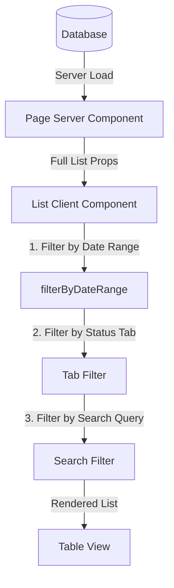

# Shared Date-Based Transaction Filtering

This document describes the architecture, utility helper functions, and integration instructions for the shared date range filter component (`DateRangeFilter`) in Business Mart.

---

## Architecture Overview

To provide a high-performance, fluid user interface, Business Mart utilizes **client-side in-memory filtering** for listing data. Instead of hitting the database on every filter selection, all matching records are fetched initially during server rendering, and subsequent filtering by status, search queries, and date ranges is done on the client.

The `DateRangeFilter` component integrates directly into this flow by providing a unified UI selector and helper functions for parsing dates and filtering lists.



---

## Component API

### `DateRangeFilter` Component

Located at: `src/components/DateRangeFilter.js`

#### Props
* **`value`** (Object): The active filter state.
* **`onChange`** (Function): Callback function executed when state changes.

#### State Structure
```javascript
{
  preset: "all" | "today" | "yesterday" | "this_week" | "this_month" | "specific_month" | "custom",
  startDate: "YYYY-MM-DD", // used when preset is "custom"
  endDate: "YYYY-MM-DD",   // used when preset is "custom"
  month: "YYYY-MM"         // used when preset is "specific_month"
}
```

---

## Utilities

The filter file exports two key helper utilities to simplify integration:

### 1. `getDefaultFilterState(defaultPreset)`
Initializes the initial filter state.
* **`defaultPreset`**: String representing the default selection (e.g. `"all"`, `"this_month"`). Defaults to `"all"`.

### 2. `filterByDateRange(records, dateField, filterState)`
Filters an array of records in memory based on the active filter state.
* **`records`**: Array of objects.
* **`dateField`**: Key name of the date field in each record (e.g., `"entryDate"`, `"createdAt"`).
* **`filterState`**: The filter state object.

---

## UI Mechanics

* **Specific Month Dropdown**: Uses native `<input type="month">` to allow picking a specific month/year.
* **Custom Range Picker**: Conditionally renders two `<input type="date">` inputs for custom start and end bounds.
* **Responsive Layout**: Adjusts automatically from a side-by-side flex layout on medium/large screens to a vertical stack on mobile viewports.

---

## Integration Guide

To implement the filter on a new page:

1. **Import Component & Utilities**:
   ```javascript
   import DateRangeFilter, { filterByDateRange, getDefaultFilterState } from "@/components/DateRangeFilter";
   ```

2. **Define Prop and Initialize State**:
   ```javascript
   export default function MyListClient({ items = [], defaultPreset = "all" }) {
     const [dateFilter, setDateFilter] = useState(() => getDefaultFilterState(defaultPreset));
     // ...
   }
   ```

3. **Apply Filtering Pipeline**:
   Ensure date filtering is applied **before** status and search query filters so that status tab counts update dynamically:
   ```javascript
   const dateFilteredItems = useMemo(() => {
     return filterByDateRange(items, "entryDate", dateFilter);
   }, [items, dateFilter]);
   ```

4. **Render UI Controls**:
   ```jsx
   <div className="flex flex-col md:flex-row gap-4 items-stretch md:items-center justify-between">
     <SearchInput />
     <DateRangeFilter value={dateFilter} onChange={setDateFilter} />
   </div>
   ```
