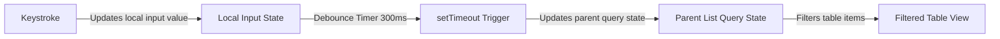

# Reusable Debounced Search Bar

This document describes the architecture, component API, and integration instructions for the shared debounced search input component (`DebouncedSearchInput`) in Business Mart.

---

## Architectural Context

In-memory list searching executes array filters on every render. Without debouncing, typing quickly in a search bar causes the entire list and all its dependent cells/computations (such as unit conversions and status sums) to re-evaluate on **every single keystroke**. This can lead to laggy input experiences, especially on devices with limited CPU resources or with very long tables.

The `DebouncedSearchInput` component introduces a short latency buffer (300ms by default). The internal input element updates immediately to keep typing smooth, while the parent state is updated only after typing pauses.



---

## Component API

### `DebouncedSearchInput` Component

Located at: `src/components/DebouncedSearchInput.js`

#### Props
* **`value`** (String): The active search query state.
* **`onChange`** (Function): Callback function executed with the new search value after the debounce delay.
* **`placeholder`** (String): Input placeholder text. Defaults to `"Search..."`.
* **`debounceTimeout`** (Number): Debounce delay in milliseconds. Defaults to `300`.
* **`className`** (String): Optional utility classes for container layout adjustments.

---

## Integration Guide

To implement the debounced search bar on a listing page:

1. **Import Component**:
   ```javascript
   import DebouncedSearchInput from "@/components/DebouncedSearchInput";
   ```

2. **Render UI Controls**:
   Replace native search inputs inside layout containers with the custom component:
   ```jsx
   <div className="flex flex-col md:flex-row gap-4 items-stretch md:items-center justify-between">
     <DebouncedSearchInput
       value={searchQuery}
       onChange={setSearchQuery}
       placeholder="Search catalog..."
     />
     {/* Other optional filters like DateRangeFilter */}
   </div>
   ```

---

## Active Page Integrations

The `DebouncedSearchInput` is integrated across the following listing views:

* **Goods Intake** (`IntakeListClient.js`): Searches by intake #, supplier, or product.
* **Sales / Billing** (`SalesListClient.js`): Searches by sale #, buyer, or product.
* **Source Tracking** (`SourceTrackingListClient.js`): Searches by product, supplier, buyer, or invoice #.
* **Supplier Settlements** (`SupplierInvoiceListClient.js`): Searches by invoice # or supplier.
* **Supplier Advances** (`AdvanceListClient.js`): Searches by supplier, remarks, or intake #.
* **Inventory / Products** (`ProductListClient.js`): Searches by product name or category.
* **Parties** (`PartyListClient.js`): Searches by name, phone number, or address.
