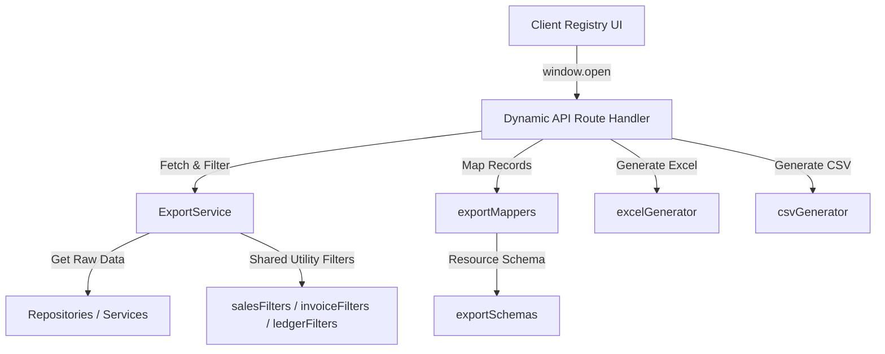

# Developer Guide: Export System Architecture

This guide explains the architecture, design choices, and extension patterns of the **Phase 2 Export System** in Business Mart.

## Overview
The Export System provides a modular, schema-driven framework for downloading ERP registry views in Excel (`.xlsx`) and CSV formats. It is designed to be **strictly read-only** and to completely reuse existing business rules and calculation services.



---

## Folder Structure
All export logic is isolated within the `src/modules/export/` directory to separate concerns from primary entity directories:
```text
src/modules/export/
├── schemas/
│   └── exportSchemas.js      # Versioned configurations mapping headers to fields/formatters
├── mappers/
│   └── exportMappers.js      # Maps database structures to schema-defined flat objects
├── generators/
│   ├── excelGenerator.js     # Generates Excel buffer (frozen header, auto-sizing columns)
│   └── csvGenerator.js       # Generates CSV text (with formula injection protection)
└── services/
    └── ExportService.js      # Orchestrates data fetching and shared query filtering
```

---

## Core Principles

### 1. Read-Only Operations
Export handlers must never modify database tables, update invoice statuses, or change financial ledgers. All database operations in this module are queries (`findMany`, `select`).

### 2. No Duplicate Calculations
Do not write export-specific formulas for totals or settlements. Mappers must rely on fields calculated by canonical database layer services (e.g. `finalPayableAmount` in settlements, or `calculateReconciliationSummary` in ledger reconciliations) to prevent date-drift or math-discrepancy bugs.

### 3. Date & Number Format Standards
- **Dates**: Normalized and formatted consistently as `YYYY-MM-DD` using `date-fns` formatting helpers.
- **Numbers**: Exported as native JavaScript `Number` types to enable sorting and cell math in spreadsheet editors (Excel/LibreOffice).

### 4. Excel Polish
- **Header Freezing**: The first row (headers) is locked using `worksheet["!views"]` with `ySplit: 1`.
- **Column Auto-Sizing**: Column widths (`!cols` with `wch` property) are dynamically calculated based on the longest string length in the column plus a padding of `3` characters.

### 5. CSV Formula Injection Protection
Values that begin with dangerous spreadsheet operator prefixes (`=`, `+`, `-`, `@`) are automatically prefixed with a single quote (`'`) in the CSV generator. This ensures spreadsheet engines do not execute payload strings as formulas.

---

## Registering a New Export Resource
To add a new entity (e.g., `Parties` or `Products`) to the export engine:

1. **Define Schema**: Add a configuration block under `src/modules/export/schemas/exportSchemas.js`:
   ```javascript
   parties: {
     version: 1,
     columns: [
       { header: "Name", key: "name" },
       { header: "Phone", key: "phoneNumber" },
       { header: "Balance", key: "netBalance", format: (v) => Number(v) }
     ]
   }
   ```
2. **Add Mapper**: Add a mapper function in `src/modules/export/mappers/exportMappers.js`:
   ```javascript
   export function mapPartyToExportModel(party) {
     return mapRecordToSchema(party, exportSchemas.parties);
   }
   ```
3. **Register route permissions & handler logic**: Add resource authorization and database fetching inside `ExportService` and `/api/export/[resource]/route.js`.
