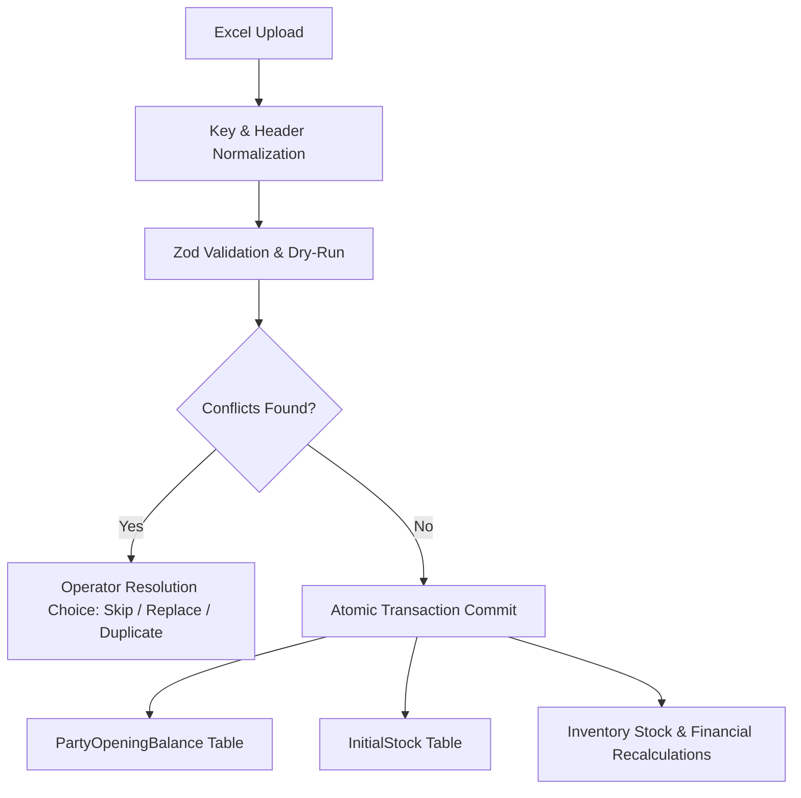

# Historical Data Onboarding Architecture

This document outlines the architecture, database models, and validation pipelines of the Historical Data Onboarding System in Business Mart.

---

## 1. Architectural Philosophy & DB Isolation

To maintain operational integrity and financial accuracy, the onboarding system avoids creating synthetic operational transactions (like fake `SaleTransactions` or `SupplierInvoices`) for starting balances. Instead, it relies on dedicated, audit-trail tables that capture the initial state of the business at migration.



### Key Principles
* **Immutability of Settings**: System configuration and settings are never used in financial calculations, unit conversions, or ledger matching. All arithmetic is derived from database records.
* **Audit-Traceable**: Every imported row is tagged with a generated `migrationId` (e.g. `MIG-1718012345-ABCDEF`).
* **Non-Clamping Inventory**: Onboarding stock supports oversold (negative) states naturally without arbitrary value clamping.

---

## 2. Database Schema

The system registers starting balances and inventory levels via two models:

```prisma
model PartyOpeningBalance {
  id           String        @id @default(uuid())
  partyId      String        @unique
  party        Party         @relation(fields: [partyId], references: [id])
  amount       Decimal       // Decimals for precise financial accounting
  type         BalanceType   // RECEIVABLE (Debit) or PAYABLE (Credit)
  notes        String?
  migrationId  String?
  userId       String
  businessId   String
  createdAt    DateTime      @default(now())
  updatedAt    DateTime      @updatedAt
}

model InitialStock {
  id           String        @id @default(uuid())
  productId    String        @unique
  product      Product       @relation(fields: [productId], references: [id])
  quantity     Decimal
  unit         String
  notes        String?
  migrationId  String?
  userId       String
  businessId   String
  salesTracks  SalesTrack[]  // Track sales allocated directly against onboarding stock
  createdAt    DateTime      @default(now())
  updatedAt    DateTime      @updatedAt
}
```

### Relations
* **1-to-1 Mapping**: A `Product` has exactly one optional `InitialStock` snapshot, and a `Party` has exactly one optional `PartyOpeningBalance` snapshot.
* **Sales Tracking**: `SalesTrack` maps sales that draw from starting inventory directly to the corresponding `InitialStock` record via `initialStockId`, preserving the audit trail of onboarding depletion.

---

## 3. Core Business Logic Integrations

### Dynamic Stock Calculation
Physical inventory levels are calculated dynamically on the fly rather than using cached column values. In `InventoryService.js`:

$$\text{Available Stock} = (\text{Initial Stock} - \text{SUM(Sales Tracks mapped to Initial Stock)}) + \text{SUM(Active Intakes)}$$

* Only committed, uncancelled sales (`SaleTransaction.status != "CANCELLED"`) are counted against the onboarding stock.
* Active intakes are those marked as `PENDING` or `PARTIAL` weight.

### Financial Position & Ledger Timeline
Opening balances are integrated into the party's net financial ledger position in `financial.js`:
* **Receivable**: Increases the net amount owed by the party to the business (+Debit).
* **Payable**: Increases the net amount owed by the business to the party (-Credit).
* **Timeline Events**: `PartyProfileService.js` injects the opening balance as the first entry (`OPENING_BALANCE`) in the party profile timeline so the starting ledger matches old physical books.

---

## 4. Onboarding Import Pipeline

The import pipeline is handled by `DataImportService.js` and split into two phases: **Dry-Run Validation** and **Atomic Commit**.

```
Upload -> Header Normalization -> Zod Schema Validation -> Business Rules -> Conflict Check -> Return Report
```

### A. Header & Key Normalization
Spreadsheets uploaded by users often have spacing or casing variations (e.g. `Phone Number`, `phone_number`, `PhoneNumber`). The static helper `DataImportService.normalizeRowKeys` performs case-insensitive translation to Zod's camelCase keys and coerces numeric fields (like Excel phone cells) to strings to prevent schemas from failing.

### B. Unit & Abbreviation Mapping
The system normalizes common unit abbreviations using the `UNIT_MAPPING` dictionary:
* `KG`, `kilogram` $\rightarrow$ `KG`
* `mnd`, `maund` $\rightarrow$ `MAUND`
* `bag` $\rightarrow$ `BAG`
* `pcs`, `piece` $\rightarrow$ `PIECE`
* `box` $\rightarrow$ `BOX`

### C. Custom Dry-Run Validation Rules
Beyond Zod constraints, `validateImport` verifies critical database consistency rules during dry-run:
1. **Category Compatibility**: Primary units and starting stock units must belong to the product's category (WEIGHT, LIQUID, or QUANTITY).
2. **Product-Specific Conversion Factors**: If `initialStockUnit` is product-specific (like `BAG` or `BOX`), a positive `unitConversion` value must be supplied either on the sheet row or exist in the database for conflicting products.

If validation checks fail, the row is marked `isValid = false` with a descriptive message, increasing the dashboard's invalid row count instead of throwing database transaction errors.

### D. Conflict Resolution & Merge Strategies
When importing records, duplicates are identified:
* **Parties**: Matched by name (case-insensitive) or phone number.
* **Products**: Matched by name (case-insensitive).

The operator is presented with three merge resolutions in the validation dashboard:
* **Skip**: The row is ignored, skipping database updates.
* **Replace**: Overwrites the existing `PartyOpeningBalance` or `InitialStock` with the spreadsheet values (and updates the product's `unitConversion` factor if specified).
* **Duplicate**: Creates a new entity by appending an `(Imported)` suffix to the name, maintaining complete separation.

### E. Atomic Database Transactions
All write commits execute within a single Prisma transaction (`prisma.$transaction`). If a single write fails or an unexpected exception occurs, the entire batch rolls back, preventing partial imports.

---

## 5. UI & State Persistence

The onboarding tab is located inside the Settings Maintenance dashboard.
* **Database-Derived Completion**: To prevent state loss on page reload, the tab queries the actual database counts of `PartyOpeningBalance` and `InitialStock` on mount using `getImportSummaryAction`.
* **State Persistence**: If onboarding has already been executed, the dashboard displays a persistent **"Historical Onboarding Complete"** status panel showing current counts and unique migration run IDs, with an option to import additional data or download the import log.
