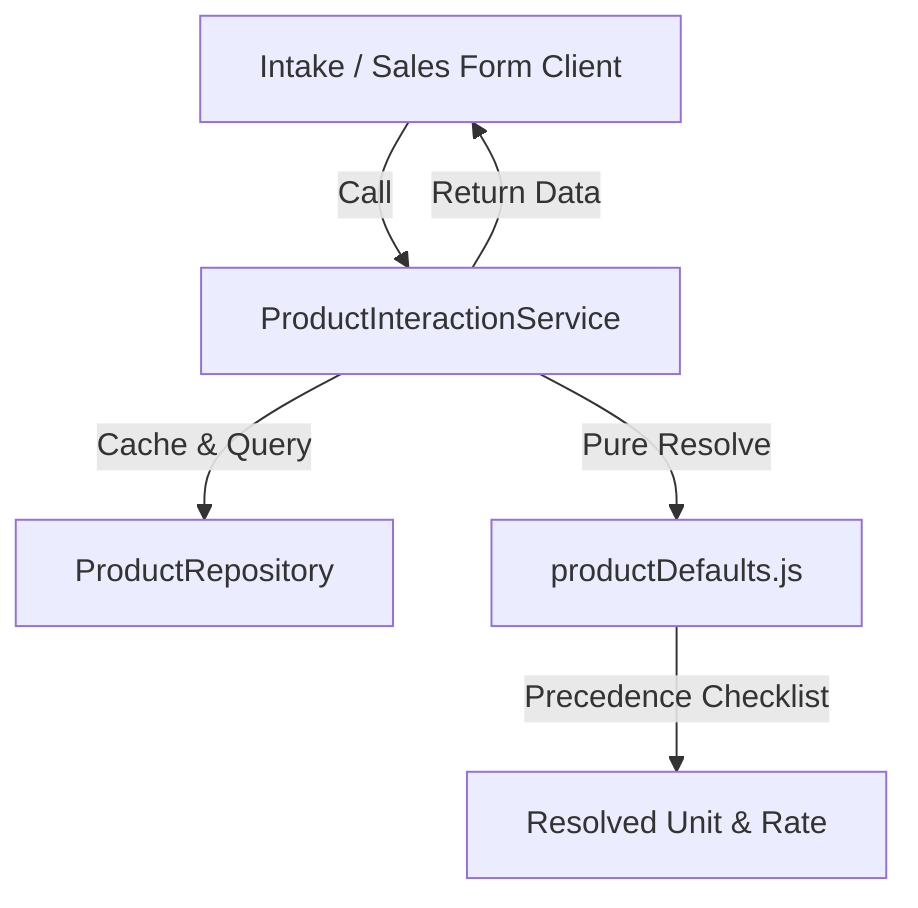

# Product Module Upgrade Developer Guide

This document outlines the architectural changes, schema additions, and integration rules introduced in the Product Module Upgrade (Phase D).

## 1. Architectural Boundaries (The Immutable Rules)

* **Settings & Configuration Boundary**: Settings (General Setup, Print Settings, etc.) are **Display and Behavioral Configuration ONLY**. They must **NEVER** be used inside financial calculations, ledger matching, or conversion logic. All core unit conversion rules reside within `@/lib/units.js`.
* **Zero-Coupling Dependency Rule**: The `Product` module must not directly import or mutate state in other core business transaction engines like `IntakeService` or `SaleService`. Instead, business engines query the product module using the adapter layer.
* **Server Action Adapter Entry Point**: All product details and defaults consumed by client components must pass through `ProductInteractionService` (e.g., `getProductForIntake`, `getProductForSale`, `getProductForPOS`). Client UIs are not permitted to query database repositories directly.

## 2. Schema Refactoring & Migrations

A dual-column strategy is utilized to transition from the legacy flat `category` string to relational `ProductCategory` grouping:
* **Legacy Column (`category`)**: Retained and kept synchronized with the new `unitCategory` to prevent breaking existing historical reports.
* **New Column (`unitCategory`)**: Tracks unit-specific categorization (e.g., `WEIGHT`, `LIQUID`, `QUANTITY`).
* **Relational Category (`productCategoryId`)**: References the `ProductCategory` master table.
* **Business Defaults**: Added default buying/selling rates, units, and display orders directly to the `Product` model.

### Database Schema Definition:
```prisma
model ProductCategory {
  id          Int       @id @default(autoincrement())
  name        String    @unique
  description String?
  isActive    Boolean   @default(true)
  products    Product[]
  
  // Auditing
  createdAt   DateTime  @default(now())
  updatedAt   DateTime  @updatedAt
  
  // Ownership
  ownerId     Int?
}

model Product {
  // ... legacy fields
  unitCategory       String   @default("WEIGHT") // WEIGHT, LIQUID, QUANTITY
  productCategoryId  Int?
  productCategory    ProductCategory? @relation(fields: [productCategoryId], references: [id], onDelete: SetNull)

  // Default Business Settings
  defaultBuyingRate  Decimal?
  buyingRateUnit     String?
  defaultSellingRate Decimal?
  sellingRateUnit    String?
  defaultSellingUnit String?
  displayOrder       Int      @default(0)
}
```

## 3. Data Integrity & Validation Rules

* **Category Deletion Safety**: A `ProductCategory` cannot be deleted if it is linked to one or more active products. If deleted, it uses `onDelete: SetNull` and records a warning regarding soft-deleted products.
* **Cross-Field Unit Compatibility**: Checked via `@/lib/units.js`'s `isUnitCompatible` function:
  * Quantities and default units must belong to the matching `unitCategory` (e.g., `WEIGHT` products cannot default to `LITER` rate units).
  * Validated at the schema level using Zod refinements on product creation and updating.

## 4. Consumption Flow


