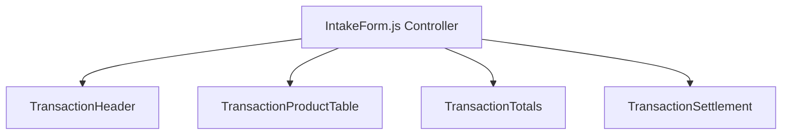
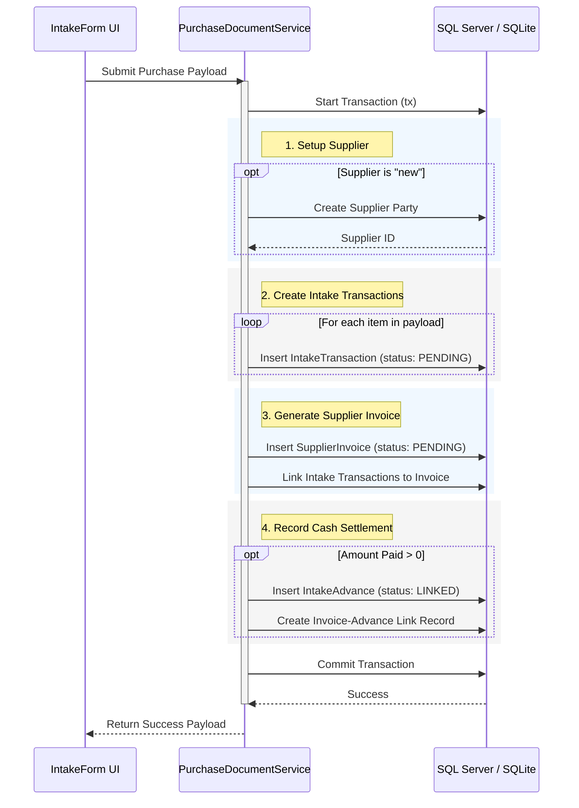

# Purchase Intake Architecture

This document outlines the technical architecture, component relationships, data flows, and transactional design of the **Purchase Intake** workflow in Business Mart.

---

## 1. Architectural Overview

The Goods Intake module operates in two modes governed by the system-wide feature flag `intakeMode`:
1. `RECEIPT`: Legacy flow optimized for commission-agent model (single product per intake, no immediate invoice/advances).
2. `PURCHASE`: A multi-product checkout flow sharing core layouts with the POS Billing system, executing an atomic transaction that generates intakes, supplier invoices, and advance payments.

### Directory Structure of Refactored Files

```
src/
├── app/
│   └── intake/
│       └── create/
│           ├── page.js             # Fetches server-side default adjustments & passes to form
│           └── IntakeForm.js       # Client page controller handling conditional mode rendering
├── components/
│   └── transaction/                # Shared domain-neutral UI Components
│       ├── TransactionHeader.js
│       ├── TransactionProductTable.js
│       ├── TransactionTotals.js
│       └── TransactionSettlement.js
└── modules/
    └── intake/
        ├── controllers/
        │   └── intakeActions.js    # Entrypoint for server action triggers
        └── services/
            └── PurchaseDocumentService.js  # Transactional orchestrator (database layer)
```

---

## 2. Frontend Component Composition

The Purchase mode of `IntakeForm.js` consumes generic transaction components configured through parameters to operate in a supplier context instead of a buyer/POS context.



### Component Parameterization Mapping:
* **`TransactionHeader`**:
  * Configured with custom labels (`partyLabel="Supplier"`, `partyPlaceholder="Select Supplier..."`, `saveLabel="Complete Purchase"`) to present a supplier selection list rather than the default POS buyer list.
  * Disables scanner and printing features (`showScanner={false}`, `showPrint={false}`).
* **`TransactionProductTable`**:
  * Utilizes product data, custom rate pre-filling, and unit registries.
  * Captures packaging helpers (e.g. Bag counts and packaging sizes) to calculate total net weights dynamically.
* **`TransactionTotals`**:
  * Computes item sums and subtracts/adds supplier adjustments (like commission deductions) using `@/lib/financial/transactionTotals`.
* **`TransactionSettlement`**:
  * Swapped to `layout="settlement"` to focus strictly on cash-paid inputs without showing POS cash calculators.

---

## 3. Database Transaction & Data Flow

When `handleSavePurchase` triggers in `IntakeForm.js`, it constructs a transaction payload and invokes `createPurchaseDocumentAction` which calls `PurchaseDocumentService.createPurchaseDocument`.

### Sequential Transaction Steps
The entire document creation occurs inside a single database transaction block (`prisma.$transaction`) to maintain referential integrity:



---

## 4. Key Arithmetic & Precisions

* **Quantity Normalization**: All weights and packaging counts are normalized to the base unit using `normalizeQuantity` from `@/lib/units.js` before financial calculations.
* **Financial Calculations**: Done exclusively inside `@/lib/financial.js` via `calculateTransactionTotals` to prevent decimal drifts, adhering to the setting configuration isolation boundary rules.
* **Rounding Rules**: Financial rounding to predefined decimal precisions occurs strictly inside the database-independent financial utility functions.
