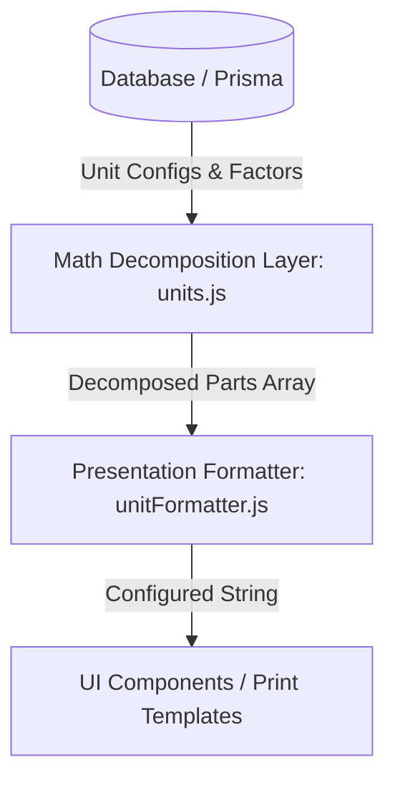

# Unit Precision Display & Decomposition Developer Guide

This guide describes the architecture and integration practices for the **Unit Precision Display System**. This system decomposes fractional/decimal product quantities into human-readable unit breakdowns (e.g., `40.525 MAUND` to `40 MND 21 KG`) based on user preferences without modifying underlying database values, financial equations, or core inventory balances.

---

## 1. Architectural Boundaries

To prevent architectural drift and maintain clean separation of concerns, the system is split into two distinct, decoupled layers:



### A. Math Decomposition Layer (`src/lib/units.js`)
- **Responsibility**: Performs pure mathematical conversions and splits. It does NOT handle text, translations, locale logic, or styling.
- **Dynamic Hierarchy**: Hierarchies are dynamically determined by querying the active units for the category and sorting them by their conversion factors in descending order (e.g. `TON (1000) -> MAUND (40) -> KG (1) -> G (0.001)`).
- **Core APIs**:
  - `getDynamicHierarchy(category, product, unitRegistry)`: Resolves and returns the ordered array of unit codes (e.g., `["TON", "MAUND", "KG", "G"]`).
  - `decomposeQuantity(quantity, unitId, product, unitRegistry, precision)`: Decomposes a quantity up to `precision` levels. At the last level, standard rounding is applied to the remainder. Performs a backward carry-over loop to avoid stock display discrepancies (e.g. `39 Maund 40 KG` carries over to `40 Maund`). Returns a parts list:
    ```json
    [
      { "value": 40, "unit": "MAUND" },
      { "value": 21, "unit": "KG" }
    ]
    ```

### B. Presentation & Formatting Layer (`src/lib/formatters/unitFormatter.js`)
- **Responsibility**: Translates unit codes, formats decimal points, and structures the final user-facing text based on formatting options.
- **Core APIs**:
  - `getUnitLabelFormatted(unitId, format, locale)`: Formats unit ID labels as `"short"` abbreviations (MND, KG, G) or `"long"` full names (Maund, Kilogram, Gram).
  - `formatDecomposedQuantity(parts, locale, labelFormat)`: Combines decomposed parts into a single string.
  - `formatUnitDisplay(quantity, unitId, product, locale, unitRegistry, settings)`: High-level wrapper that decomposes and formats based on global preferences:
    - If `settings.unitDisplayPrecision === 0`, it defaults to decimal display (e.g., `40.53 MND`) with `settings.decimalPlaces`.
    - Otherwise, decomposes up to `settings.unitDisplayPrecision` levels.

---

## 2. Developer Integration Guide

### How to Render a Decomposed Unit in UI / Print Views

Always use `formatUnitDisplay` from `@/lib/formatters/unitFormatter`. Pass `settings` or `printConfig` as the 6th argument to respect user preferences.

#### Rendering inside React Detail Pages
```javascript
import { formatUnitDisplay } from "@/lib/formatters/unitFormatter";

// Renders based on settings: "40 MND 21 KG" or "40.53 MND" or "40 Maund 21 Kilogram"
return (
  <span>
    {formatUnitDisplay(item.weight, item.unit, item.product, "en", null, printConfig)}
  </span>
);
```

#### Rendering inside Print templates
```javascript
import { formatUnitDisplay } from "@/lib/formatters/unitFormatter";

// Renders according to document printConfig
return (
  <span className="font-bold">
    {formatUnitDisplay(data.grossWeight, data.unit, data.product, locale, null, printConfig)}
  </span>
);
```

---

## 3. Strict Rules for Developers

1. **Do NOT reuse or mix with `financialFormatter.js`**:
   - The financial formatter must remain independent of unit formatting. Do not import `unitFormatter.js` inside `financialFormatter.js`.
2. **Always Pass Product Context**:
   - Always supply the `product` parameter to `formatUnitDisplay` when rendering line-item quantities. This ensures that product-specific conversions (like custom pack sizes or bags) are resolved correctly.
3. **Never Mutate/Round Database Values**:
   - Formatting must happen strictly at the presentation layer during rendering. The database must always store pure, raw floats (e.g. `40.525`).
4. **Propagate Settings**:
   - When calling `formatUnitDisplay`, always pass the merged settings/printConfig object so user preferences (decimal mode, depth level, long names) are respected system-wide.
