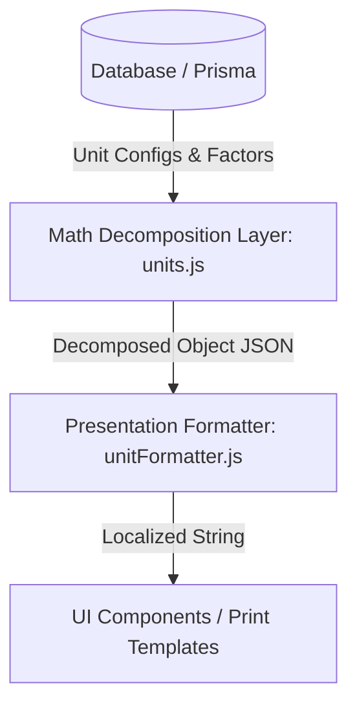

# Unit Precision Display System Guide

This guide describes the architecture and integration practices for the **Unit Precision Display System**. This system decomposes fractional/decimal product quantities into human-readable unit breakdowns (e.g. `40.5 MAUND` to `40 MND 20 KG`) without modifying underlying database values, financial equations, or core inventory balances.

---

## 1. Architectural Boundaries

To prevent architectural drift and maintain clean separation of concerns, the system is split into two distinct, decoupled layers:



### A. Math Decomposition Layer (`src/lib/units.js`)
- **Responsibility**: Performs pure mathematical conversions and splits. It does NOT handle text, translations, locale logic, or styling.
- **Dynamic Hierarchy**: Hierarchies are dynamically determined by querying the active units for the category and sorting them by their conversion factors in descending order (e.g. `TON (1000) -> MAUND (40) -> KG (1) -> G (0.001)`).
- **Core APIs**:
  - `getDynamicHierarchy(category, product, unitRegistry)`: Resolves and returns the ordered array of unit codes (e.g., `["TON", "MAUND", "KG", "G"]`).
  - `decomposeQuantity(quantity, unitId, product, unitRegistry)`: Decomposes a quantity into its integer part and remainder converted to the next lower unit. Returns a raw data object:
    ```json
    {
      "value": 40,
      "unit": "MAUND",
      "secondaryValue": 20,
      "secondaryUnit": "KG"
    }
    ```

### B. Presentation & Formatting Layer (`src/lib/formatters/unitFormatter.js`)
- **Responsibility**: Translates unit codes, formats decimal points, and structures the final user-facing text based on the selected language/locale.
- **Core APIs**:
  - `formatDecomposedQuantity(decomposed, locale)`: Translates unit codes (`MAUND` -> `MND` in English or `من` in Urdu) and constructs the final text.
  - `formatUnitDisplay(quantity, unitId, product, locale)`: High-level wrapper that decomposes and formats in a single step.

---

## 2. Developer Integration Guide

### How to Render a Decomposed Unit in UI / Print Views

Always use `formatUnitDisplay` from `@/lib/formatters/unitFormatter`. Avoid local string formatting, custom checks, or manual math operations in JSX/UI markup.

#### English Locale Example (UI Lists & Details)
```javascript
import { formatUnitDisplay } from "@/lib/formatters/unitFormatter";

// Renders "40 MND 20 KG" or "1 KG 250 G"
return (
  <span>
    {formatUnitDisplay(item.weight, item.unit, item.product, "en")}
  </span>
);
```

#### Urdu Locale Example (Print Subsystem Receipts)
```javascript
import { formatUnitDisplay } from "@/lib/formatters/unitFormatter";

// Renders "40 من 20 کلو"
return (
  <span className="font-bold">
    {formatUnitDisplay(data.grossWeight, data.unit, data.product, "ur")}
  </span>
);
```

---

## 3. Strict Rules for Developers

1. **Do NOT reuse or mix with `financialFormatter.js`**:
   - The financial formatter must remain independent of unit formatting. Do not import `unitFormatter.js` inside `financialFormatter.js`.
2. **Always Pass Product Context**:
   - Always supply the `product` parameter to `formatUnitDisplay` when rendering line-item quantities. This ensures that product-specific conversions (like custom pack sizes or bags) are resolved correctly.
3. **Never Mutate/Round Database Values**:
   - Formatting must happen strictly at the presentation layer during rendering. The database must always store pure, raw floats (e.g. `40.5`).
