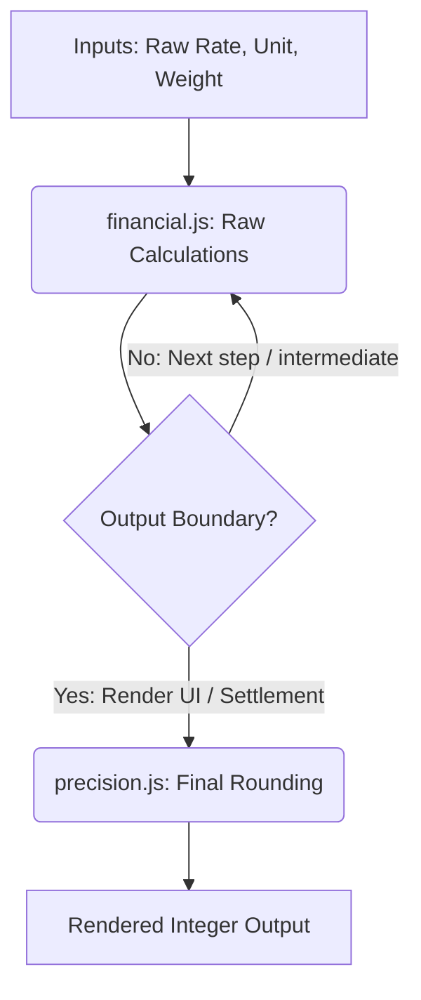

# Business-Mart Developer Guide: Financial Engine Precision & Stabilization Architecture

This document outlines the architectural guidelines, core files, and rules governing financial calculations and precision handling in Business Mart.

---

## 🎯 Core Goal

The system maintains **strict infinite-precision internally** throughout all mathematical pipelines (conversions, adjustments, deductions, and base amounts) and delegates rounding exclusively to the **final output boundaries** (UI display templates, settlement PDF sheets, and reports).

This design completely eliminates numerical drift and conversion errors across modules.

---

## 1. Directory Structure & File Roles

```
src/
├── lib/
│   ├── financial.js       # PURE Calculation Engine (NEVER performs rounding)
│   └── precision.js       # Boundary Precision Layer (Handles display/output rounding)
```

---

## 2. Core Components

### A. The Pure Calculation Engine (`src/lib/financial.js`)

`financial.js` acts strictly as a **deterministic mathematical engine**. Its responsibilities are limited to:
* Converting values (weight, quantity, rates)
* Computing adjustment values
* Aggregating base and adjustment totals

#### 🚨 Safety Warning Lock:
Every calculation function inside `financial.js` must return raw, high-precision floating-point numbers. No internal rounding is allowed.

```javascript
// WARNING:
// This file must NEVER perform rounding.
// Rounding is handled ONLY in precision layer at output boundary.
```

#### Guidelines for `financial.js`:
* **Do NOT use `round()` inside loops** or on intermediate values.
* **All calculator returns** (e.g. `calculateAdjustment`, `calculateFinalTotal`, `calculateTransactionTotals`, `calculateSupplierDeductions`) must yield unrounded values.
* The legacy `round` utility is kept strictly as a compatibility wrapper for downstream clients, but is **never** invoked within any calculation.

---

### B. The Boundary Precision Layer (`src/lib/precision.js`)

Output-stage rounding is delegated entirely to the boundary layer using the `Precision.final(value)` helper.

```javascript
import { Precision } from "@/lib/precision";

// Rounds strictly at the final output boundary
const finalPayable = Precision.final(rawAmount); // Returns rounded integer
```

#### Rules for Output Rounding:
1. **Integer Only**: Final rounding rounds to `0` decimal places.
2. **KG & Currency Only**: Only KG-based weights and monetary totals can undergo final rounding.
3. **Maund & Product Units**: Non-KG units (e.g. **MAUND**, **BAG**) **MUST NEVER be rounded**, keeping their full mathematical precision intact for reports.

---

## 3. Reference Workflow Spec



### Example Usage:
```javascript
import { calculateTransactionTotals } from "@/lib/financial";
import { Precision } from "@/lib/precision";

// 1. Calculate raw transaction values using the pure engine
const rawTotals = calculateTransactionTotals(items, adjustments);

// 2. Round at UI / display boundary
const displayFinalAmount = Precision.final(rawTotals.finalAmount);
const displayTotalWeightInKg = Precision.final(rawTotals.totalWeight);
```
