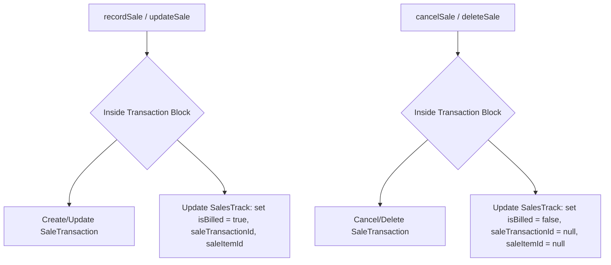

# Developer Guide: Sold Intakes Invoicing & Settlement Suggestion System

This document outlines the architecture, database schema, workflow state machine, unit conversion patterns, and UI integration for the sold intakes invoicing and settlement suggestion feature.

---

## 1. Overview & Architectural Goals

When an `IntakeTransaction` is updated or marked with the status **`SOLD`**, it transitions from a simple inventory record to a billable business event. At this point:
1. **Supplier Settlement (Supplier Invoice)**: The intake becomes eligible to be settled and billed back to the supplier.
2. **Sales Invoicing (Sales Invoice)**: The intake is mapped to a buyer relationship via the **`SalesTrack`** layer. It becomes eligible to be suggested and imported into a new Sales Invoice for that buyer.

### Key Guidelines
* **SalesTrack Independence**: `SalesTrack` acts as an *optional* business register layer. A sales invoice can still be created manually without any pre-existing `SalesTrack` or `IntakeTransaction` record.
* **Strict State Isolation**: We avoid checking `saleTransactionId IS NULL` as the core business logic. Instead, we use explicit boolean flags (`isBilled` and `isSettled`) to determine invoicing eligibility.
* **Bi-directional unit consistency**: Prices and weights are stored normalized (per-KG) in the system's tracking layers but must be converted back to the original units (e.g., Maund) seamlessly in the user interfaces.

---

## 2. Database Schema Details

In the Prisma schema, the `SalesTrack` model links intakes to sales and keeps track of billing state using dedicated fields:

```prisma
model SalesTrack {
  id                  Int       @id @default(autoincrement())
  saleTransactionId   Int?
  saleItemId          Int?
  intakeTransactionId Int?      @unique

  supplierPartyId     Int?
  buyerPartyId        Int?
  productId           Int?

  quantity            Decimal   @db.Decimal(18, 2) // Stored in KG (normalized)
  buyingRate          Decimal?  @db.Decimal(18, 2) // Stored in KG (normalized)
  sellingRate         Decimal?  @db.Decimal(18, 2) // Stored in KG (normalized)
  netWeight           Decimal?  @db.Decimal(18, 2) // Stored in original unit weight
  baseAmount          Decimal?  @db.Decimal(18, 2)

  isBilled            Boolean   @default(false)
  isSettled           Boolean   @default(false)

  // Relations
  intakeTransaction   IntakeTransaction? @relation(fields: [intakeTransactionId], references: [id])
}
```

---

## 3. Back-end Services & State Machine

### 3.1 Fetching Eligible Suggestions
To query suggestions on the **New Sale Invoice** screen, we retrieve unbilled sales tracks matching the selected buyer:

```javascript
// SalesTrackService.js
static async listUnbilledByBuyer(buyerPartyId) {
  const tracks = await prisma.salesTrack.findMany({
    where: {
      buyerPartyId: parseInt(buyerPartyId),
      isBilled: false,
    },
    include: {
      intakeTransaction: true,
      product: true
    },
    orderBy: { createdAt: "desc" }
  });
  
  // Ensure strict serialization of Decimals and Dates to avoid server-to-client component payload crashes
  return tracks.map(track => ({
    ...track,
    quantity: Number(track.quantity),
    buyingRate: track.buyingRate ? Number(track.buyingRate) : null,
    sellingRate: track.sellingRate ? Number(track.sellingRate) : null,
    netWeight: track.netWeight ? Number(track.netWeight) : null,
    baseAmount: track.baseAmount ? Number(track.baseAmount) : null,
    createdAt: track.createdAt.toISOString(),
    updatedAt: track.updatedAt.toISOString(),
    intakeTransaction: track.intakeTransaction ? {
      ...track.intakeTransaction,
      rate: track.intakeTransaction.rate ? Number(track.intakeTransaction.rate) : null,
      grossWeight: Number(track.intakeTransaction.grossWeight),
      normalizedWeight: Number(track.intakeTransaction.normalizedWeight),
      Bardana: track.intakeTransaction.Bardana ? Number(track.intakeTransaction.Bardana) : null,
      Khot: track.intakeTransaction.Khot ? Number(track.intakeTransaction.Khot) : null,
      netWeight: track.intakeTransaction.netWeight ? Number(track.intakeTransaction.netWeight) : null,
      entryDate: track.intakeTransaction.entryDate.toISOString(),
      createdAt: track.intakeTransaction.createdAt.toISOString(),
      updatedAt: track.intakeTransaction.updatedAt.toISOString(),
    } : null
  }));
}
```

### 3.2 Atomically Managing the Billing State
When a sale is recorded, updated, or deleted, the corresponding `SalesTrack` records must be updated inside the database transaction:



---

## 4. UI & Unit Conversion Integration

### 4.1 Inverse Unit & Rate Conversion
Because `SalesTrack` stores rates and quantities in base units (`KG`), they must be converted back to the original unit (e.g. `MAUND`) using the centralized conversion engine when pre-filling fields:

* **Conversion Formula**:
  * **Rate**: Converted using `convertRate(storedRate, "KG", originalUnit, product)`
  * **Weight**: Converted using `convertFromBase(storedWeight, originalUnit, product)`

### 4.2 Suggestions Panel Interaction in `SaleForm.js`
When a buyer is selected, the suggestions panel dynamically queries the Server Action `getUnbilledTracksAction`.

* Clicking **+ Add** on a suggestion invokes `handleSelectTrack(track)`:
  1. Computes the `displayRate` and `displayWeight` in the original unit.
  2. Adds the item row prefilled with:
     * `productId`, `weight`, `rate`, `unit`, `rateUnit`.
     * `salesTrackId`: mapped to link the track.
     * `intakeNumber`: triggers a visual badge (`Intake: INT-XXXXXX`) below the product dropdown.
  3. Filters the selected track out of the active suggestions list.
* If a prefilled row is deleted or modified to switch products, the track is automatically released back to the suggestions list.

---

## 5. Supplier Settlement Screen Filtering

To prevent cluttering the settlement creation page (`/supplier-invoices/create`), supplier list queries are filtered directly in the Server Component to only display supplier parties with outstanding (uninvoiced) sold intakes:

```javascript
// src/app/supplier-invoices/create/page.js
const suppliers = await prisma.party.findMany({
  where: {
    isActive: true,
    OR: [
      { partyType: "SUPPLIER" },
      { partyType: "BOTH" }
    ],
    intakeTransactions: {
      some: {
        status: "SOLD",
        invoiceItems: {
          none: {
            invoice: {
              status: { not: "SUPERSEDED" }
            }
          }
        }
      }
    }
  },
  orderBy: { name: "asc" }
});
```
