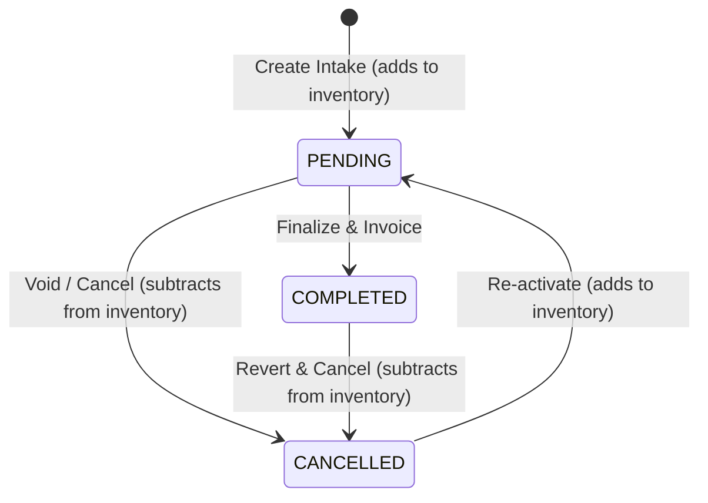

# Goods Intake & Stock Lifecycle Guide

This document outlines the core principles, measurement systems, state transitions, and safety invariants of the **Goods Intake** system in Business Mart.

---

## 🎯 Core Concepts

The **Goods Intake** system is the entry point for all physical inventory in Business Mart. It records product arrivals from suppliers, establishes raw stock levels, manages optional advance payments, and feeds the centralized inventory engine.

---

## 📏 Measurement & Unit Conversion System

Business Mart preserves the **exact unit** entered by the operator while storing a standardized weight in the product's **base unit** (usually KG) in the database.

### 1. Dual-Unit Archival Architecture
*   **Operational Suffix (`grossWeight` & `unit`)**: Preserves the actual entry format used by the supplier (e.g., `10 MAUND`, `50 BAG`, `200 KG`). This is used for printing receipts, bills, and invoicing.
*   **Normalized Value (`normalizedWeight`)**: Calculates the weight in the base unit dynamically at the service layer during entry/update using the product's `unitConversion` multiplier.

### 2. Live Conversion Example (Maund to KG)
$$\text{Normalized Weight (KG)} = \text{Gross Weight (Maund)} \times 40$$

If a supplier delivers **`10 MAUND`** of Wheat:
*   The transaction stores `grossWeight: 10.00` and `unit: "MAUND"`.
*   The normalized field stores `normalizedWeight: 400.00` (KG).
*   The operational inventory snapshot (`Product.quantity`) is incremented by **`400.00`**.

---

## 🔄 Intake Lifecycle & Status Transitions

Each intake transaction has a lifecycle determined by its `status` field: `PENDING`, `COMPLETED`, or `CANCELLED`.

### Detailed Status Definitions

| Status | Meaning | Affects Inventory? | Billing & Ledger Status |
| :--- | :--- | :--- | :--- |
| **`PENDING`** | Goods are physically present at the warehouse but waiting for final pricing, inspection, or billing. | **YES (Active)** Normalized weight is active in `Product.quantity` stock. | Active. Open to supplier invoices and payment advances. |
| **`COMPLETED`** | The delivery has been matched to supplier invoices, reconciled, and fully settled. | **YES (Active)** No change to stock during `PENDING` $\rightarrow$ `COMPLETED`. | Locked. Part of finalized ledgers. |
| **`CANCELLED`** | The intake was declared invalid, rejected, returned, or logged in error. | **NO (Voided)** Stock is automatically decremented from `Product.quantity`. | Completely excluded from invoices and reports. |

---

## 🛡️ Stock Safety & Inventory Invariants

To prevent accounting discrepancy and negative physical stock states, the system enforces the following strict business invariants during the intake lifecycle:

> [!IMPORTANT]
> **Negative Inventory Prevention Rule**
> The operational stock of any product (`Product.quantity`) must **NEVER go below 0** under any circumstances.

### 1. Cancellation Guard
When an active intake (`PENDING` or `COMPLETED`) is changed to `CANCELLED`, or when an intake is **deleted**, the system must subtract its weight from the product's stock snapshot.
*   **The Guard**: Before completing the subtraction, the system queries `Product.quantity`.
*   **The Invariant**: If `Product.quantity < normalizedWeight`, the transaction is **aborted and rolled back**.
*   **Error Thrown**: `INSUFFICIENT_STOCK: Reverting intake stock would result in negative inventory.`

### 2. Product Update Guard
If an operator edits an intake and changes the `productId` (switching the product):
*   The system safely **decrements** the old product's stock (applying the negative inventory guard).
*   The system **increments** the new product's stock.

---

## 📂 Implementation References

All business and database logic relating to the Goods Intake lifecycle is contained in these files:

*   **Database Schema**: [schema.prisma](file:///d:/Projects/Next%20JS/prisma/schema.prisma) defines the `IntakeTransaction` model.
*   **Validation Schema**: [intakeSchema.js](file:///d:/Projects/Next%20JS/src/modules/intake/validations/intakeSchema.js) parses and sanitizes forms.
*   **Service Layer Orchestrator**: [IntakeService.js](file:///d:/Projects/Next%20JS/src/modules/intake/services/IntakeService.js) handles transactional stock snapshot increments, decrements, and conversion math.
*   **Action Controllers**: [intakeActions.js](file:///d:/Projects/Next%20JS/src/modules/intake/controllers/intakeActions.js) processes incoming server requests.
