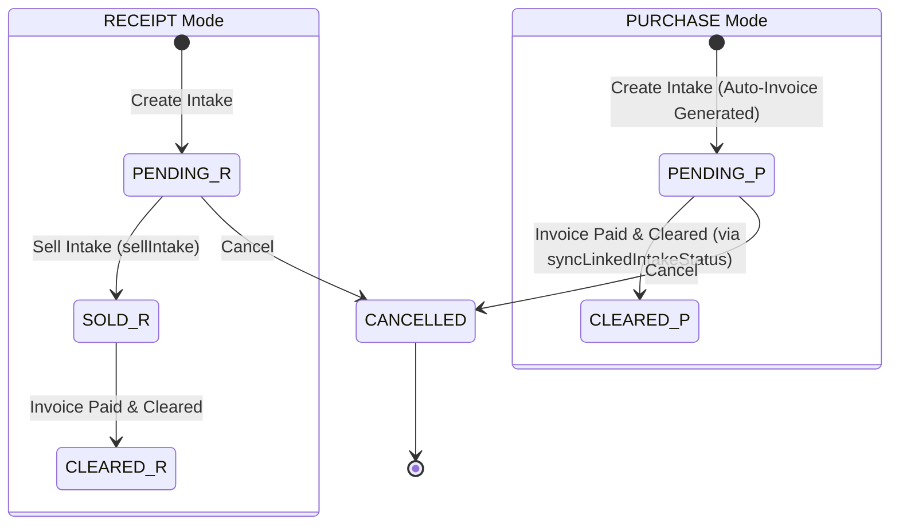

# Developer Guide: Generalized Goods Intake & Stock Lifecycle

This document outlines the core architecture, transactional workflows, status lifecycle, validations, and safety invariants of the **Goods Intake** system in Business Mart.

---

## 🎯 Architectural Overview

The Goods Intake system supports two distinct operational modes governed by the global `intakeMode` feature flag:
1. **`RECEIPT` Mode (Classic Grain Market)**: Focuses on crop arrivals, storage refractions, and selling portion-based tracks.
2. **`PURCHASE` Mode (Generalized Inventory)**: Handles direct goods purchases, requiring a purchase rate immediately, and automatically generating associated supplier invoices upon creation.

---

## 🔄 Lifecycle & Status Transitions

### Mode-Aware Lifecycles
* **`RECEIPT` Mode**: 
  `PENDING` (Physical arrival) $\rightarrow$ `SOLD` (Weight & quality verified, sold to a buyer) $\rightarrow$ `CLEARED` (Settled & paid).
* **`PURCHASE` Mode**:
  `PENDING` (Invoice unpaid) $\rightarrow$ `CLEARED` (Invoice paid). Selling is disabled.

### Status Synchronization (`PURCHASE` Mode)
In `PURCHASE` mode, status transitions are driven purely by the linked supplier invoice's payment status:
* **Invoice Paid/Cleared**: Triggers `SupplierInvoiceService.syncLinkedIntakeStatus(invoiceId, tx)`, which updates all linked intake status fields to `CLEARED`.
* **Invoice Unpaid**: Reverts linked intake status fields to `PENDING`.

---

## 🛡️ Invariants & Validation Checks

The system enforces strict constraints at the service layer to prevent inconsistent financial and inventory states:

### 1. Supplier Change Protection
To avoid mismatching ledger entries, cash advances, and settlements:
* Changing an intake's supplier (`partyId`) is **strictly blocked** if the intake has linked cash advances or is linked to an existing **Supplier Invoice**.
* Operators must first delete linked advances or delete/disconnect the invoice before changing the supplier.

### 2. Lock-on-Payment
* If an intake is associated with a paid or partially cleared supplier invoice, it is **locked**.
* The service layer blocks all edits (`updateIntake`) and deletions (`deleteIntake`, `hardDeleteIntake`) on the intake while the invoice is cleared.

### 3. Inventory Stock Recalculation Guard
* All inventory updates are delegated to `InventoryService.recalculateProductStock(productId, tx)`.
* Every creation, update, and deletion is executed within a single transaction block (`tx`) passed to the recalculation function. This ensures that the stock quantity (`Product.quantity`) is recalculated atomically without race conditions.

---

## 💾 Transactional Operations

### 1. Intake Creation Flow (`_createIntakeInternal`)
All creation operations occur within a single database transaction:
1. Generate the unique intake number (`INT-XXXXXX`).
2. Insert the `IntakeTransaction` record.
3. If an advance payment is provided, insert the `IntakeAdvance` linked to the intake.
4. If in `PURCHASE` mode, call `SupplierInvoiceService.generateInvoiceForPurchaseIntake` to generate the supplier invoice.
5. Recalculate product stock in `InventoryService`.

### 2. Cascading Deletion Flow
Both soft and hard deletions are fully transaction-safe:
1. **Unpaid Invoice Check**: Throws an error if the linked invoice is already paid/cleared.
2. **Linked Invoice Cleanup**: Calls `SupplierInvoiceService.deleteInvoice` or `hardDeleteInvoice` passing `tx`.
3. **Linked Advances Cleanup**: Deletes associated `IntakeAdvance` records using `tx` (since `IntakeAdvance` has no soft-delete column).
4. **Inventory Recalculation**: Triggers stock recalculation for the product using `tx`.
5. **Intake Cleanup**: Soft-deletes (sets `isDeleted: true`) or hard-deletes the `IntakeTransaction` record.

---

## 📂 Code Files & References

* **Service Layer**: [IntakeService.js](file:///d:/Projects/Next%20JS/src/modules/intake/services/IntakeService.js)
* **Invoice Orchestrator**: [SupplierInvoiceService.js](file:///d:/Projects/Next%20JS/src/modules/supplier-invoices/services/SupplierInvoiceService.js)
* **Inventory Recalculations**: [InventoryService.js](file:///d:/Projects/Next%20JS/src/modules/products/services/InventoryService.js)
* **Feature Flag Configuration**: [featureFlags.js](file:///d:/Projects/Next%20JS/src/lib/settings/featureFlags.js)
