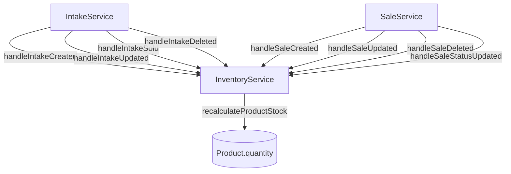

# Inventory Philosophy & Centralized Stock Management

This document defines the authoritative inventory model for Business Mart. All developers working on stock-related features **must** follow the rules described here.

---

## Core Principle

> **Physical inventory is controlled exclusively through the Intake lifecycle.**
>
> - **PENDING intake** = stock physically available in the warehouse.
> - **SOLD intake** = stock already allocated/sold — removed from available inventory.
> - **CANCELLED intake** = excluded from inventory entirely.
>
> **Sales invoices are billing/accounting records and do NOT directly mutate inventory.**
> Inventory movement happens at Intake status transition, **NOT** at billing/sales stage.

---

## Stock Formula

```
Product.quantity = SUM(normalizedWeight)
                   FROM IntakeTransaction
                   WHERE productId = <product>
                     AND status = "PENDING"
```

- `normalizedWeight` is derived from `grossWeight` (the raw arriving weight).
- `netWeight` is a billing/settlement value (after Bardana/Khot deductions) and does **NOT** affect inventory.
- The stock calculation is always based on **gross weight**, never net weight.

---

## Unified InventoryService

All stock modifications pass through a single unified service:

**Location:** `src/modules/products/services/InventoryService.js`



### Intake Events (ACTIVE — modify inventory)

| Method | Trigger | Effect |
|--------|---------|--------|
| `handleIntakeCreated(productId, tx)` | New intake created | Recalculates stock to include new pending intake |
| `handleIntakeUpdated(oldProductId, newProductId, tx)` | Intake edited (weight, product, status) | Recalculates stock for both old and new product |
| `handleIntakeSold(productId, tx)` | Intake marked as SOLD | Recalculates stock — intake no longer pending |
| `handleIntakeDeleted(productId, tx)` | Intake deleted | Recalculates stock — deleted intake excluded |

### Sales Events (NO-OP under current model)

| Method | Trigger | Effect |
|--------|---------|--------|
| `handleSaleCreated(items, tx)` | New sale recorded | No-op |
| `handleSaleUpdated(deltas, tx)` | Sale edited | No-op |
| `handleSaleDeleted(items, tx)` | Sale deleted | No-op |
| `handleSaleStatusUpdated(items, old, new, tx)` | Sale status changed | No-op |

> **Why no-ops?** Under the intake-driven model, sales are accounting/billing records.
> The physical stock change already happened when the corresponding intake was marked SOLD.
> If you were to deduct stock on both "Intake → SOLD" and "Sale recorded", you would get
> **double-deduction** — the exact bug this architecture eliminates.

---

## Recalculation vs. Delta-Based Updates

The previous architecture used **incremental delta** updates (`increment` / `decrement`).
This approach was fragile:
- Concurrent transactions could cause drift.
- Complex branching for status changes, product changes, and weight changes was error-prone.
- Over time, the running total diverged from the true state.

The new architecture uses **full recalculation** (`SUM` aggregate query) on every change:
- The stock value is always **derived from source data**, never from a running counter.
- No possibility of drift or mismatch.
- Simpler code — no delta branching logic.

---

## Backfill Script

If the database ever needs re-alignment, run:

```bash
node scripts/backfill-product-quantity.mjs
```

This script:
1. Queries all products.
2. For each product, sums `normalizedWeight` of PENDING intakes.
3. Sets `Product.quantity` to the computed sum.
4. Prints a verification table and validates sample products.

---

## Future Extensibility

If the business model evolves to require sales-driven inventory deduction:
1. Implement the logic **inside `InventoryService`** (in the `handleSale*` methods).
2. Do **NOT** add `tx.product.update` calls directly in `SaleService`.
3. Update this document to reflect the new rules.

The no-op stubs exist precisely for this purpose — they are documented extension points
that can be activated without changing the call sites in `IntakeService` or `SaleService`.

---

## Implementation References

- **InventoryService**: [InventoryService.js](file:///d:/Projects/Next%20JS/src/modules/products/services/InventoryService.js)
- **IntakeService** (delegator): [IntakeService.js](file:///d:/Projects/Next%20JS/src/modules/intake/services/IntakeService.js)
- **SaleService** (delegator): [SaleService.js](file:///d:/Projects/Next%20JS/src/modules/sales/services/SaleService.js)
- **Backfill Script**: [backfill-product-quantity.mjs](file:///d:/Projects/Next%20JS/scripts/backfill-product-quantity.mjs)
