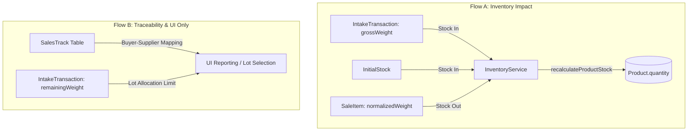

# Inventory Philosophy & Centralized Stock Management

This document defines the authoritative inventory model for Business Mart. All developers working on stock-related features **must** follow the rules described here.

---

## Core Principle

> **Physical inventory is increased by active Intakes and decreased by finalized Sales.**
>
> - **Intake Role = Pure Stock In Register**: Active intakes (non-cancelled, non-deleted) represent physical stock arriving at the warehouse. Their `status` and `remainingWeight` are purely operational metadata (Flow B) and do **NOT** affect available stock calculations.
> - **Sale Role = Pure Stock Out Register**: Active sales (non-cancelled, non-deleted) represent physical stock leaving the warehouse. Stock is deducted only when the `SaleTransaction` is finalized.
>
> **The Single Source of Truth Rule:**
> Stock is always derived strictly from:
> $$\text{Stock} = \text{InitialStock} + \text{Gross Intakes} - \text{Sales}$$

---

## Flow A vs. Flow B Separation

To prevent developer confusion and eliminate the double-deduction bug, the system maintains a strict conceptual and code-level separation:



- **Flow A (Inventory Impact)**: Authorized purely by `InitialStock`, `IntakeTransaction` gross weights, and `SaleItem` normalized weights. The `InventoryService` manages this logic.
- **Flow B (Traceability & UI Only)**: Used for reporting, historical tracing, and preventing over-allocation in the Create Sale UI. Creating a `SalesTrack` or updating an intake's `remainingWeight` has **zero** effect on physical inventory math.

---

## Stock Formula

```
Product.quantity = InitialStock + SUM(normalized gross weight of Intakes) - SUM(normalized weight of Sales)
```

- `normalized gross weight` is derived from `grossWeight` (the raw arriving weight).
- `netWeight` is a billing/settlement value (after Bardana/Khot deductions) and does **NOT** affect inventory.
- `remainingWeight` is an operational traceability value (Flow B) and does **NOT** affect inventory.
- All stock calculations are based on gross weight.

---

## Unified InventoryService

All stock modifications pass through a single unified service:

**Location:** `src/modules/products/services/InventoryService.js`

### Recalculation Trigger Hooks

| Method | Trigger | Effect |
|--------|---------|--------|
| `handleIntakeCreated(productId, tx)` | New intake created | Recalculates stock to include the new intake gross weight |
| `handleIntakeUpdated(oldProductId, newProductId, tx)` | Intake edited (weight, product, status) | Recalculates stock for both old and new product |
| `handleIntakeDeleted(productId, tx)` | Intake deleted | Recalculates stock — deleted intake excluded |
| `handleSaleCreated(items, tx)` | New sale recorded | Recalculates stock to deduct the finalized sale weights |
| `handleSaleUpdated(deltas, tx)` | Sale edited | Recalculates stock for all affected products |
| `handleSaleDeleted(items, tx)` | Sale deleted | Recalculates stock — deleted sale items excluded |
| `handleSaleStatusUpdated(items, old, new, tx)` | Sale status changed | Recalculates stock — cancelled/restored sales handled correctly |

---

## Onboarding Snapshot Updates

- `InitialStock` represents the onboarding snapshot.
- If a product's `InitialStock` is updated (e.g. via Data Import corrections), it is treated as a live correction to the onboarding starting point, immediately triggering a full stock recalculation for the affected product.

---

## Backfill Script

If the database ever needs re-alignment, run:

```bash
node scripts/backfill-product-quantity.mjs
```

---

## Implementation References

- **InventoryService**: [InventoryService.js](file:///d:/Projects/Next%20JS/src/modules/products/services/InventoryService.js)
- **IntakeService**: [IntakeService.js](file:///d:/Projects/Next%20JS/src/modules/intake/services/IntakeService.js)
- **SaleService**: [SaleService.js](file:///d:/Projects/Next%20JS/src/modules/sales/services/SaleService.js)
