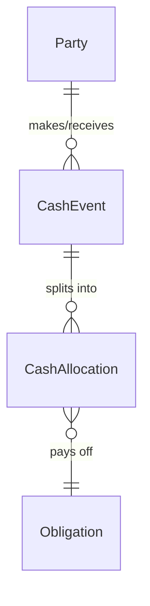

# Unified Cash Event & Allocation Model Report

To prevent domain-specific drift and keep database engines highly reusable, core financial modules should decouple **cash movement** (the cash event) from the **business transaction** (the obligation). 

This report demonstrates how a single, generic schema for Cash Events and Allocations supports:
1. **Grain Market Commission Shops**
2. **Retail POS Systems**
3. **Service/Consulting Businesses**

---

## 1. The Generic Database Schema

Using the exact same two tables, we can model cash movements and settlement allocations for any industry:



### Table A: `CashEvent`
Represents an actual movement of cash (real-world money). It does not contain billing rules, item lists, or sales logic.

```sql
CREATE TABLE CashEvent (
  id            INTEGER PRIMARY KEY AUTOINCREMENT,
  partyId       INTEGER NOT NULL,          -- Customer, Vendor, Client, or Supplier
  direction     TEXT NOT NULL,             -- IN (Cash Inflow) or OUT (Cash Outflow)
  amount        DECIMAL(12,2) NOT NULL,    -- Total money moved
  paymentMethod TEXT NOT NULL,             -- CASH, BANK, CHEQUE, MOBILE
  status        TEXT NOT NULL DEFAULT 'A', -- ACTIVE, VOIDED
  entryDate     DATETIME NOT NULL,         -- Business calendar day
  createdAt     DATETIME DEFAULT CURRENT_TIMESTAMP
);
```

### Table B: `CashAllocation`
A mapping table that links a `CashEvent` to one or more outstanding obligations (e.g. Sales, Invoices, Bills). Any portion of a `CashEvent` not mapped here is dynamically computed as **unallocated cash** (prepayments or customer credit).

```sql
CREATE TABLE CashAllocation (
  id              INTEGER PRIMARY KEY AUTOINCREMENT,
  cashEventId     INTEGER NOT NULL,
  referenceType   TEXT NOT NULL,           -- The target entity type (e.g., SALE, INVOICE)
  referenceId     INTEGER NOT NULL,        -- The target entity primary key ID
  allocatedAmount DECIMAL(12,2) NOT NULL,  -- Amount applied to this specific obligation
  createdAt       DATETIME DEFAULT CURRENT_TIMESTAMP,
  FOREIGN KEY (cashEventId) REFERENCES CashEvent(id)
);
```

---

## 2. Business Industry Implementations

### Example A: Grain Market Commission Shop
Grain commission agents deal with multi-day supplier settlements, advances, and bulk sales.

* **Obligations (what is owed):**
  * `SaleTransaction` (Buyer owes the market for a crop purchase)
  * `SupplierInvoice` (Market owes the supplier for crop inward shipments)
* **How the Schema behaves:**

```json
/* 1. Cash Inflow: Buyer pays Rs. 150,000 via bank */
{
  "table": "CashEvent",
  "id": 101,
  "partyId": 3,              // Buyer (Party 3)
  "direction": "IN",
  "amount": 150000.00,
  "paymentMethod": "BANK"
}

/* 2. Allocations: Rs. 100,000 pays off Sale #5; Rs. 50,000 is left unallocated as store credit */
{
  "table": "CashAllocation",
  "cashEventId": 101,
  "referenceType": "SALE",
  "referenceId": 5,
  "allocatedAmount": 100000.00
}
```

---

### Example B: Retail POS (Point of Sale)
A retail store sells items at a counter. Customers buy goods on credit or prepay to load store balances.

* **Obligations (what is owed):**
  * `DailyTicket` or `CustomerOrder` (Ticket details, items bought, tax, totals)
* **How the Schema behaves:**

```json
/* 1. Cash Inflow: Customer pays Rs. 5,000 cash to top up their account balance */
{
  "table": "CashEvent",
  "id": 202,
  "partyId": 89,             // Customer (Party 89)
  "direction": "IN",
  "amount": 5000.00,
  "paymentMethod": "CASH"
}

/* 2. Allocations: Later, the customer buys products on Ticket #123 worth Rs. 3,500 */
{
  "table": "CashAllocation",
  "cashEventId": 202,
  "referenceType": "DAILY_TICKET",
  "referenceId": 123,
  "allocatedAmount": 3500.00
}
/* Unallocated remainder (Rs. 1,500) automatically remains as customer store credit */
```

---

### Example C: Service Business (Consulting / Agencies)
A software consulting agency bills clients for retainer agreements, project milestones, and hours worked.

* **Obligations (what is owed):**
  * `ProjectMilestone` or `TimeSheetInvoice` (Professional services bills)
* **How the Schema behaves:**

```json
/* 1. Cash Inflow: Client pays Rs. 300,000 bank transfer as project retainer deposit */
{
  "table": "CashEvent",
  "id": 303,
  "partyId": 12,             // Client (Party 12)
  "direction": "IN",
  "amount": 300000.00,
  "paymentMethod": "BANK"
}

/* 2. Allocations: Client is billed for Milestone A (Rs. 200,000) and Milestone B (Rs. 100,000) */
{
  "table": "CashAllocation",
  "cashEventId": 303,
  "referenceType": "PROJECT_MILESTONE",
  "referenceId": 11,
  "allocatedAmount": 200000.00
}
{
  "table": "CashAllocation",
  "cashEventId": 303,
  "referenceType": "PROJECT_MILESTONE",
  "referenceId": 12,
  "allocatedAmount": 100000.00
}
```

---

## 3. Structural Comparison Matrix

| Aspect | Grain Market | Retail POS | Service / Consulting |
| :--- | :--- | :--- | :--- |
| **`partyId` Mapping** | Commission Shop Buyer/Supplier | End Consumer | Corporate Client |
| **Primary Obligations** | Sales, Supplier Invoices | Store Tickets, Orders | Monthly Retainers, Milestones |
| **`referenceType` Value** | `SALE` or `SETTLEMENT` | `DAILY_TICKET` or `INVOICE` | `MILESTONE` or `HOURLY_BILL` |
| **Unallocated Cash State** | Customer Advance Credit | Prepaid Gift Card / Balance | Retainer Deposit on Account |
| **Reversed / Void Flow** | Bounces crop shipment | Returns retail products | Adjusts hourly service credits |

---

## 4. Architectural Verdict
The model is **highly generic and scalable**. Because `CashEvent` and `CashAllocation` only store **party identifiers, currency quantities, and polymorphic string references (`referenceType`)**, the schema is completely decoupled from business domain logic.

Whether processing a truckload of wheat, a basket of groceries, or an hourly consulting invoice, the financial core calculates ledger positions using the same mathematical identity:
$$\text{Net Position} = \sum \text{Debit Obligations} - \sum \text{Credit Obligations} - \text{Unallocated Cash}$$
This confirms that the schema implemented for Business Mart is forensically generalizable and future-proof.
