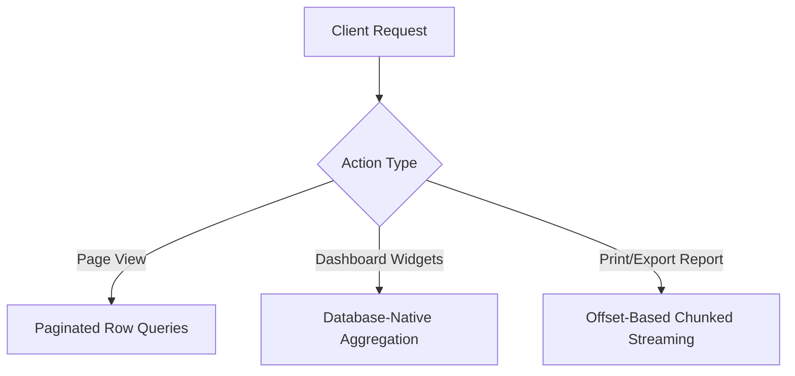

# Ledger Pagination & Scaling Architecture

This document describes the architectural implementation for scaling the Ledger & Reconciliation system to support large volumes of transactions (exceeding 1 million records).

---

## 1. The Scaling Problem

Because the ledger is a **derived view** that aggregates and compares physical operations, the original implementation fetched the entire history of invoices and sales for the selected period into memory. For large periods (5,000+ invoices/sales), this caused:
- High database query latency due to complex, heavy joins.
- Massive JSON deserialization overhead on the server and client.
- UI lockups during React DOM reconciliation.

---

## 2. Three-Pronged Query Architecture

To ensure indefinite scalability, the data retrieval process is split into three independent pathways:



### A. Database-Native Pagination (Paginated Row Queries)
Instead of loading all records and slicing them client-side, the server retrieves exactly the subset of records required for the current page:
- **API Methods**: `LedgerService.getLiveInvoices` and `LedgerService.getLiveSales`.
- **Query Operators**: Uses Prisma's `skip` and `take` operators.
- **Selective Projection**: To minimize serialization cost, we query only the columns needed for rendering, avoiding nested `include` blocks unless strictly necessary.

### B. Database-Native Aggregations (Summary Metrics)
To display the Ledger Dashboard summary cards (Totals, Differences, Count badges), we must not fetch the row data.
- **API Method**: `LedgerService.getLiveReconciliationSummary`.
- **Query Operators**: Uses native Prisma `aggregate` and `count` operations.
- **Result**: Returns computed totals and record counts directly from SQL without fetching any transaction records into server memory.

### C. Offset-Based Chunked Streaming (Print & Export)
When printing or exporting a report, the client requires the entire, unpaginated dataset for that period. To prevent NodeJS heap memory overflows on 100k+ records:
- **API Method**: `LedgerService.getLiveReconciliationPrintData`.
- **Strategy**: Executes a sequential offset loop, fetching rows in batches of `1,000` records until all matching items are read and streamed.

---

## 3. Pagination Caching Strategy

The ledger system utilizes a server-side caching bucket (`ledger`) to optimize repeat visits. To accommodate paginated views, cache keys are strictly bound to all pagination and query parameters:

```javascript
const liveDataKey = `live_${startDate}_${endDate}_${supplierId}_${buyerId}_${invPage}_${salePage}_${invLimit}_${saleLimit}_${searchQuery}`;
```

### Invalidation Rules:
- Saving, toggling locking, or deleting a reconciliation session invalidates the `"ledger"` cache bucket entirely via `invalidateCacheBucket("ledger")`.

---

## 4. URL-Driven State Flow

All list filters, page indexes, page sizes, and search queries are stored directly in the browser's URL search parameters:
- `invPage`: Invoice pagination page (default: `1`).
- `salePage`: Sale pagination page (default: `1`).
- `limit`: The row limit for both tables (default: `50`, options: `50`, `100`, `200`).
- `search`: Search input string.
- `supplierId` / `buyerId`: Filtering parameters.

### Keystroke Debouncing
To prevent duplicate network round-trips and page lag while typing in the search input:
1. The search query is held in local React state.
2. A debounced update handler delays pushing the updated value to the URL by `300ms–500ms`.
3. When the URL updates, Next.js triggers a Server Component re-render to load the new dataset.
