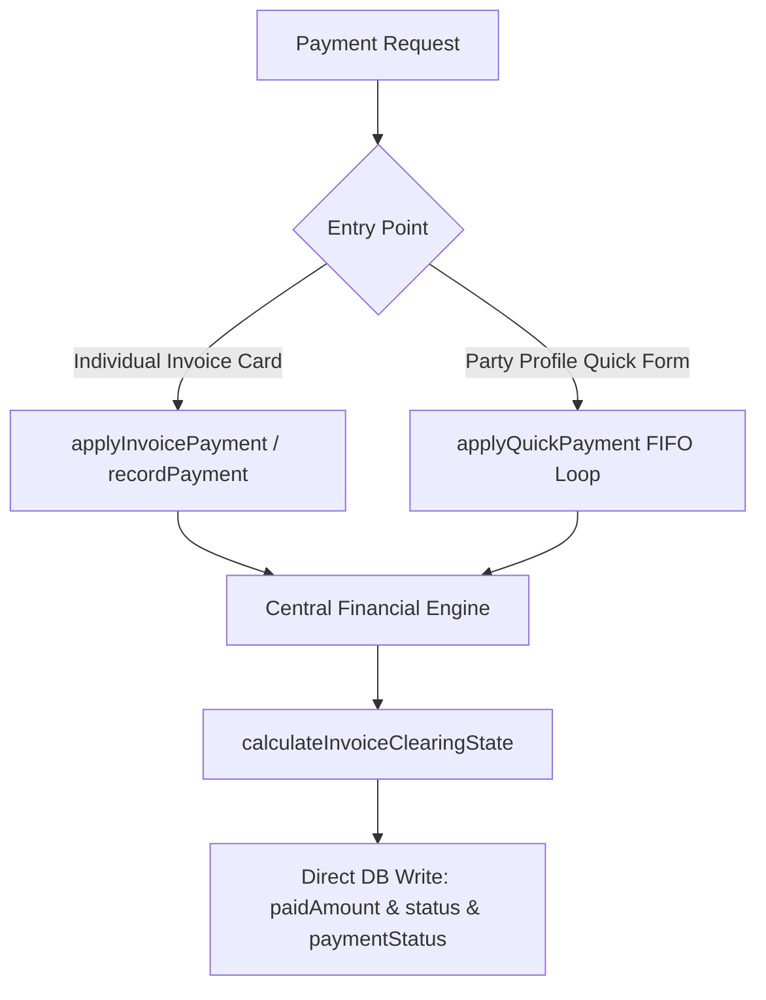

# Unified Partial Payment System

This guide documents the design, implementation, and core mathematical invariants of the Unified Partial Payment and sequential invoice clearing system. 

---

## 1. Architectural Philosophy: The "Rule of One"

To avoid double-allocation, database mismatch, and complex ledger out-of-sync issues, the system enforces **One Invoice = One Payment State Machine**. 

1. **Invoice as the Sole Source of Truth**: All financial outstanding balances and payments are derived directly from the columns `finalAmount` (or `finalPayableAmount`) and `paidAmount` on the individual invoice tables themselves (`SaleTransaction` and `SupplierInvoice`).
2. **No Allocation Tables**: The legacy `PartyPayment` and `PartyPaymentAllocation` tables are completely bypassed and deprecated. Funding flows directly into the invoice records.
3. **Aligned Operational & Financial Status**: Mismatch bugs are completely eliminated by ensuring the operational `status` column and the financial `paymentStatus` column are kept perfectly in sync by the database transaction during updates.



---

## 2. Centralized Mathematical Engine

The core math is centralized in [financial.js](file:///d:/Projects/Next%20JS/src/lib/financial.js) via the function `calculateInvoiceClearingState(totalAmount, paidAmount)`.

### Logical Rules
* **Pending Status**: If `paidAmount <= 0`, `paymentStatus` is `PENDING`.
* **Partial Status**: If `paidAmount > 0` and `paidAmount < totalAmount`, `paymentStatus` is `PARTIAL`.
* **Cleared Status**: If `paidAmount >= totalAmount`, `paymentStatus` is `CLEARED`.

### Aligned Status Mapping
During payment execution, both the operational `status` and financial `paymentStatus` columns are written atomically with the derived `paymentStatus` to enforce logical cohesion.

---

## 3. Database Schema Mapping

The database schema stores invoice-level states in:
* **Sale Transactions**: [SaleTransaction](file:///d:/Projects/Next%20JS/prisma/schema.prisma) (`finalAmount`, `paidAmount`, `status`, `paymentStatus`).
* **Supplier Invoices**: [SupplierInvoice](file:///d:/Projects/Next%20JS/prisma/schema.prisma) (`finalPayableAmount`, `paidAmount`, `status`, `paymentStatus`).

---

## 4. Payment Execution Interfaces

### A. Individual Invoice Payments (Direct)

Individual detail pages render premium payment sidebar cards (`SalePaymentCard` and `SupplierPaymentCard`) enabling shopkeepers to input partial or full direct payments.

These call server actions which invoke direct service methods:
* **Buyer Page Sales**: Calls [SaleService.recordPayment](file:///d:/Projects/Next%20JS/src/modules/sales/services/SaleService.js):
  * Performs database transaction using `prisma.$transaction`.
  * Computes total and remaining values.
  * Asserves that `amt <= remaining`.
  * Computes new state and updates both `status` and `paymentStatus` dynamically.
* **Supplier Settlements**: Calls [SupplierInvoiceService.recordPayment](file:///d:/Projects/Next%20JS/src/modules/supplier-invoices/services/SupplierInvoiceService.js):
  * Blocks payments on cancelled (`CANCELLED`) or superseded (`SUPERSEDED`) settlements.
  * Atomic update and state derivation.

### B. Sequential Chronological Clearance (FIFO)

Shopkeepers can enter a lump sum amount at the party profile level to clear multiple outstanding bills sequentially.

This is executed via [PartyProfileService.applyQuickPayment](file:///d:/Projects/Next%20JS/src/modules/parties/services/PartyProfileService.js):
1. **Fetch Outstanding Invoices**: Queries outstanding invoices (`PENDING` or `PARTIAL`) matching the party type (`CASH_IN` for buyers/sales, `CASH_OUT` for suppliers/settlements), sorted by entry date ascending:
   ```javascript
   orderBy: [
     { entryDate: "asc" },
     { id: "asc" }
   ]
   ```
2. **Transaction Loop**: Inside `prisma.$transaction`, allocates the incoming payment sequentially:
   * Subtracts outstanding balance for the oldest bill until the payment is depleted.
   * Modifies **only** the actual invoice record columns (`paidAmount`, `paymentStatus`, `status`).
3. **Excess Spillover**: Tracks any unallocated excess amount and returns a clean detail object to the UI:
   ```json
   {
     "totalApplied": 10000.00,
     "allocations": [
       { "invoiceNumber": "SALE-101", "allocated": 4000.00, "paymentStatus": "CLEARED" },
       { "invoiceNumber": "SALE-102", "allocated": 6000.00, "paymentStatus": "PARTIAL" }
     ],
     "unallocatedAmount": 0.00
   }
   ```

---

## 5. Activity Log Taxonomy

To keep event logging stable and strictly decouple it from domain-specific enum explosions, activity logging uses existing stable schemas:
* **Entity Types**: `SALE` or `SETTLEMENT`.
* **Actions**: 
  * `UPDATED`: Fired for partial clearing adjustments.
  * `CLEARED`: Fired when the invoice's new status transitions to `CLEARED`.
* **Metadata**: JSON payload detailing `partyId`, `paymentAmount`, `paidAmount`, and `paymentStatus` for perfect audit tracking.
