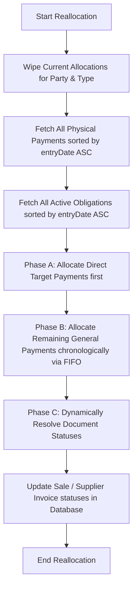

# Party Ledger Settlement & FIFO Clearing Developer Guide

This guide details the architecture, database models, algorithms, and integration hooks for the chronological **Party Ledger Settlement and FIFO Clearing Layer** in the Business Mart ERP.

---

## 🎯 Architectural Philosophy

Our core billing and transactional systems are historical and ledger-grade. To avoid complex state-machines and double-entry drift, we separate physical cash events from operational clearing interpretations:

1. **Physical Cash Layer (Database Truth):** Historical receipts and payouts (`CASH_IN` and `CASH_OUT`) are recorded as immutable `PartyPayment` events. They represent the actual money entering or leaving the system and are never modified by the engine.
2. **Metadata Allocation Layer (Dynamic Interpretations):** Clearing matches are stored as `PartyPaymentAllocation` rows. These map parts of a physical payment to specific invoices (`SALE` or `SETTLEMENT`).
3. **Chronological FIFO Settlement Engine (`PartySettlementService`):** An idempotent controller that completely wipes and regenerates allocations for a party, parsing obligations in ascending date order.

This dynamic self-repairing design allows operators to edit, regenerate, or delete historical sales, settlements, or payments. The engine simply reruns and heals all clearing logs chronologically.

---

## 💾 Database Schema Details

The settlement engine introduces two new Prisma models in `prisma/schema.prisma`:

### 1. `PartyPayment`
Stores physical cash movement events:
* `paymentNumber` (`String` @unique): Autogenerated human-readable code (e.g. `PAY-IN-1002`, `PAY-OUT-1002`).
* `paymentType` (`String`): Either `CASH_IN` (buyer collection) or `CASH_OUT` (supplier payout).
* `paymentMethod` (`String`): `CASH`, `BANK`, `JAZZCASH`, `EASYPAISA`, `CHEQUE`.
* `amount` (`Decimal`): Total cash value of the transaction.
* `directReferenceType` & `directReferenceId` (`String?`, `Int?`): Anchors a payment directly to a specific obligation, bypassing standard FIFO matching.

### 2. `PartyPaymentAllocation`
Links payments to specific obligations:
* `paymentId` (`Int`): References the source `PartyPayment` (cascades on delete).
* `referenceType` (`String`): The obligation document type (`SALE` or `SETTLEMENT`).
* `referenceId` (`Int`): The obligation ID.
* `allocatedAmount` (`Decimal`): The portion of this payment allocated to this obligation.

---

## ⚙️ Chronological FIFO Engine Workflow

The core clearing logic is implemented in `PartySettlementService.reallocateFIFO(partyId, type)`:



### Direct Target Matching Override (Phase A)
Payments with a `directReferenceId` are mapped directly to their specified target obligation first, ensuring that direct checkouts or hand-paid invoices are settled exactly as intended, regardless of sequence.

### General FIFO Allocation (Phase B)
Remaining standard payments are distributed sequentially. For each payment, the engine loops through unpaid or partially paid obligations in date order, allocating money up to the remaining required balance.

### Dynamic Document Status Mapping (Phase C)
Once allocations are computed, the engine dynamically resolves the status of each obligation:
* **Allocated = 0:** Status remains `PENDING`.
* **Allocated < Required:** Status transitions to `PARTIAL`.
* **Allocated >= Required:** Status transitions to `CLEARED` (or `COMPLETED` for supplier invoices).

---

## 🔗 Transactional Integration Hooks

To maintain real-time clearing synchronization, FIFO reallocations are triggered automatically at all transactional mutation points:

### 1. Sales Hooks (`src/modules/sales/services/SaleService.js`)
* `recordSale()`: Triggers `PartySettlementService.reallocateFIFO(partyId, "CASH_IN")`.
* `updateSale()`: Triggers `PartySettlementService.reallocateFIFO(partyId, "CASH_IN")`.
* `updateStatus()`: Triggers `PartySettlementService.reallocateFIFO(partyId, "CASH_IN")`.
* `deleteSale()`: Triggers `PartySettlementService.reallocateFIFO(partyId, "CASH_IN")`.

### 2. Settlement Hooks (`src/modules/supplier-invoices/services/SupplierInvoiceService.js`)
* `generateInvoice()`: Triggers `PartySettlementService.reallocateFIFO(partyId, "CASH_OUT")`.
* `regenerateInvoice()`: Triggers `PartySettlementService.reallocateFIFO(partyId, "CASH_OUT")`.
* `deleteInvoice()`: Triggers `PartySettlementService.reallocateFIFO(partyId, "CASH_OUT")`.

### 3. Bidirectional Status Synchronization (`supplierInvoiceActions.js`)
When an operator changes the status of a supplier invoice from the details page or list:
* **Transition PENDING → COMPLETED:** Automatically records a matching cash payment with direct target references to the invoice, triggering FIFO clearing.
* **Transition COMPLETED → PENDING:** Automatically locates and deletes the matching cash payment, dynamically reverting statuses of all related documents.

---

## 🧪 Verification Patterns

Developers extending these features should run programmatic clearing checks. Copy this test block into a temporary script and run with `tsx`:

```javascript
import { PartySettlementService } from "@/modules/parties/services/PartySettlementService";
import { prisma } from "@/lib/prisma";

// 1. Record a payment
const payment = await PartySettlementService.recordPayment({
  partyId: 90,
  paymentType: "CASH_IN",
  amount: 50000,
  paymentMethod: "CASH",
  notes: "Developer Verification Payout"
});

// 2. Delete payment to trigger self-repair
await PartySettlementService.deletePayment(payment.id);
```
