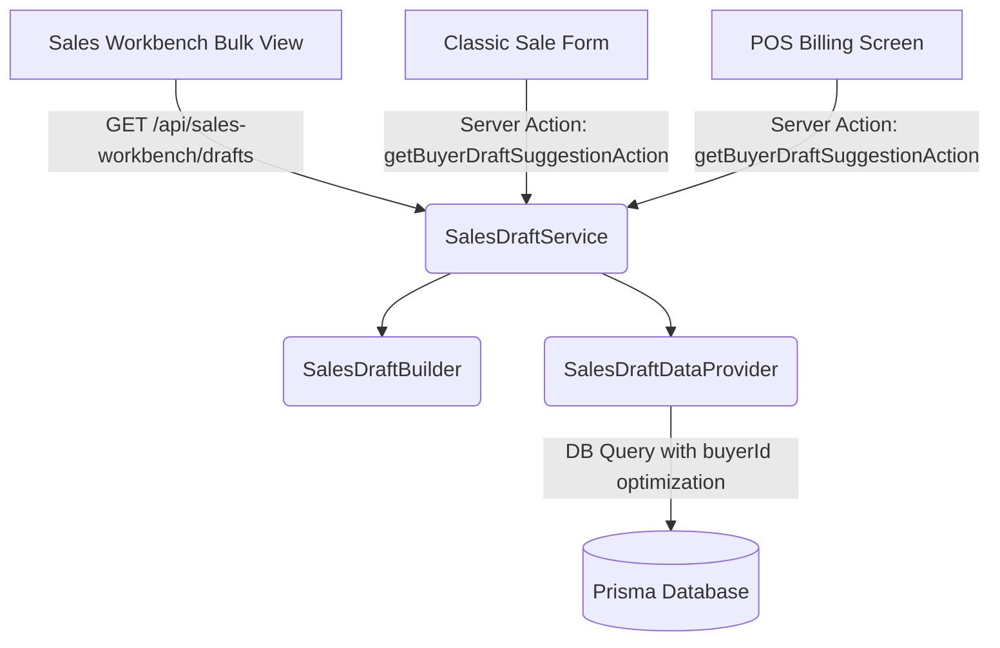

# Centralized Sales Draft Suggestion System

This document outlines the architecture, data flow, developer guidelines, and user workflows for the unified **Sales Draft Suggestion System** in Business Mart.

---

## 1. Architectural Overview

To eliminate duplicate UI logic and ensure consistent draft calculations across the ERP, the sales suggestion engine is unified into a single service layer. 



### Key Components

1. **`SalesDraftDataProvider`**: Handles raw database retrieval for unbilled intake `SalesTrack` records and direct sale transaction histories. It supports `buyerId` parameters to optimize point-of-sale queries.
2. **`SalesDraftBuilder`**: Synthesizes and matches buyer records to build a cohesive draft suggestion containing items, weights, rates, categories, and matching rationale.
3. **`SalesDraftService`**: The single source of truth for suggestions:
   * `getAllSuggestedDrafts()`: Fetes and builds suggestions for all active buyers (used in bulk workbench).
   * `buildDraftForBuyer(buyerId)`: Fetches and builds suggestions *only* for the targeted buyer (highly optimized for client forms).
4. **`getBuyerDraftSuggestionAction(buyerId)`**: Next.js Server Action exposing transactional suggestion lookup to client-side components without API route overhead.
5. **`DraftSuggestionCard`**: A stateless, presentational React component that renders suggestion lines, handles item selection checkboxes, and executes prefill callbacks consistently across three screens.

---

## 2. Developer Integration Guidelines

### How to Retrieve Suggestions in New Pages/Forms
Always use the server action `getBuyerDraftSuggestionAction` on the client side:

```javascript
import { getBuyerDraftSuggestionAction } from "@/modules/sales-workbench/controllers/workbenchActions";
import DraftSuggestionCard from "@/components/sales/DraftSuggestionCard";

// Inside React Component:
const [draftSuggestion, setDraftSuggestion] = useState(null);

useEffect(() => {
  if (buyerId) {
    getBuyerDraftSuggestionAction(buyerId).then(res => {
      if (res.success) {
        setDraftSuggestion(res.draft);
      }
    });
  }
}, [buyerId]);

// In Render:
<DraftSuggestionCard
  draftSuggestion={draftSuggestion}
  onApply={handleApplyPrefill}
  isCompact={false} // Use true for POS/compact sidebar rendering
/>
```

### Prefill Bypass Rule
To avoid duplicate prompts or overriding manual invoice overrides, **never fetch draft suggestions** if:
* The current state has items or draft records already loaded.
* The query parameter `prefilled=true` is present in the URL (indicating redirection from the Workbench).

---

## 3. User Workflows

### A. The Sales Workbench Redirect Flow
1. Navigate to the **Sales Workbench** (under Sales in the Sidebar).
2. The Workbench aggregates all buyers with unbilled intakes or direct purchasing patterns.
3. Check/uncheck individual draft items on any buyer's card.
4. Click **Convert** on the card.
5. The system redirects to the **Create Sale** form with the query parameters:
   `?partyId=X&salesTrackIds=Y&directPrefills=Z&prefilled=true`
6. The Create Sale page parses these query parameters and automatically loads the items into the invoice.
7. Because `prefilled=true` is set, the Create Sale page skips suggestion loading, allowing the user to submit or modify the prefilled items directly.

### B. The Direct Sale Suggestion Flow
1. Navigate directly to **Create Sale** or **POS Billing**.
2. Select a buyer from the Searchable Select dropdown.
3. The page calls `getBuyerDraftSuggestionAction(buyerId)` asynchronously.
4. A card displaying "Intelligent Draft Invoice Available" appears as a banner.
5. Click **Use Draft** to immediately prefill the invoice details.

---

## 4. Architectural Safety & Future Extensions

### Strict Service Boundary Rule
To prevent suggestion generation code duplication from creeping back:
*   **Boundary Restriction**: `SalesDraftBuilder` must **never** be imported or instantiated directly by API routes, Server Actions, controllers, or UI components. Only `SalesDraftService` is authorized to invoke draft building logic.

### Domain-Driven Prefills & Safety (Future Recommendations)
1.  **Stateful Prefill Invalidation**:
    *   Currently, the prefill bypass depends on frontend state parameters (`prefilled=true` in query string). In future iterations, we recommend introducing a backend-persisted draft state or transaction session token to enforce state checks at the domain level.
2.  **Buyer Switch Conflict Handling**:
    *   If a user loads prefilled items from one buyer but manually changes the buyer selector afterward, the form should trigger a confirmation prompt to clear/re-evaluate draft suggestions corresponding to the new buyer.

