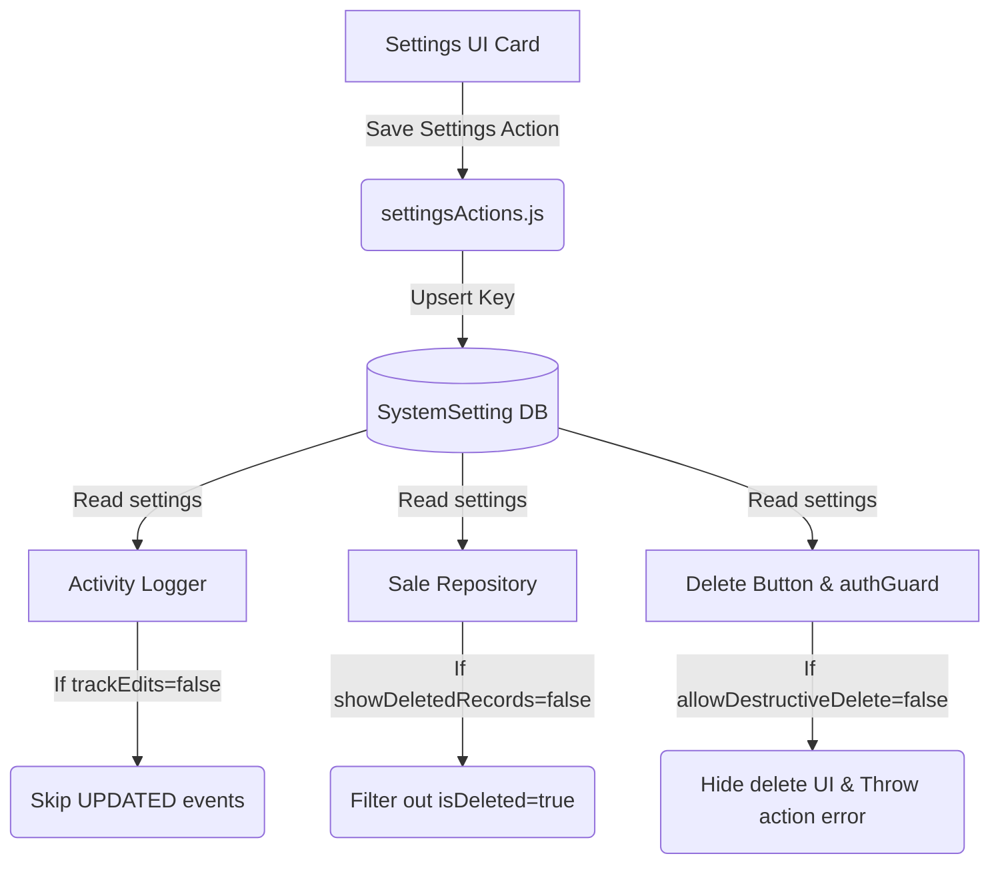

# Activity & Audit Settings Subsystem Documentation

The Activity & Audit Settings subsystem manages operational configuration flags for telemetry logging retention, soft-deleted record display visibilities, and data safety constraints inside Business Mart.

---

## ⚠️ Core Rule: Configuration vs Logic

Telemetry logging, audit logs, and soft-delete states are handled independently in the backend services and repositories. The Settings Module behaves strictly as a **Behavioral Configuration Layer (Config Only)**.

**SETTINGS MUST NEVER:**
- Implement the telemetry logging engine or log insertion logic.
- Override or bypass backend deletion safety validations directly.
- Mutate delete columns or purge database records independently of service rules.

---

## 🗄️ Storage Schema & Key

All settings are persisted inside the `SystemSetting` table under the unique key:

```text
activity_audit_settings
```

### JSON Schema

```json
{
  "logRetentionDays": 30,
  "trackEdits": true,
  "showDeletedRecords": false,
  "allowDestructiveDelete": false
}
```

---

## ⚙️ Setting Keys & Behaviors

### 1. Log Retention Days (`logRetentionDays`)
- **Default**: `30`
- **Purpose**: Defines the period (in days) after which system activity logs are cleaned up or archived. A value of `0` retains logs indefinitely.
- **Integration**: Accessed during batch log purging scripts to delete records older than the specified duration.

### 2. Track Updates in Activity Log (`trackEdits`)
- **Default**: `true`
- **Purpose**: Determines whether edit/update actions are captured in the system-wide activity log.
- **Integration**: Checked in `src/modules/activity-log/activityLogger.js` before dispatching `UPDATED` telemetry events. Skips logging if `false`.

### 3. Show Deleted Records (`showDeletedRecords`)
- **Default**: `false`
- **Purpose**: Toggles client-facing visibility of soft-deleted entries (such as sales).
- **Integration**: Checked dynamically in read query repository actions (e.g. `SaleRepository.getAll()`) to control whether `isDeleted` rows are included in read operations.

### 4. Allow Destructive Deletes (`allowDestructiveDelete`)
- **Default**: `false`
- **Purpose**: Restricts administrative record deletion capabilities across the platform.
- **Integration**:
  - **Frontend**: Hides delete action buttons completely from the UI inside `DeleteButton.js`.
  - **Backend**: Asserts deletion settings guard during Server Action verification checks (`src/lib/authGuard.js` -> `assertDeletePermission`).

---

## 🗺️ Integration Flow Diagram


