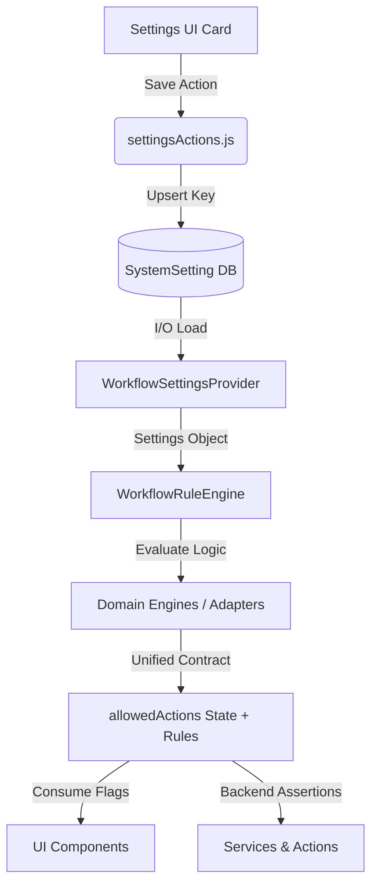

# Intake Workflow Settings Subsystem Documentation

The Intake Workflow Settings subsystem manages operational configuration flags for defaults, validations, and transitions related to intake, sales, and supplier invoice transaction lifecycles inside Business Mart.

---

## ⚠️ Core Rule: Configuration vs Logic

Settings (defaults, toggles, validators) represent **Display and Behavioral Configuration ONLY**.

**SETTINGS MUST NEVER:**
- Implement or alter financial calculations, rates, or quantity conversions.
- Perform double-entry ledger matching or account reconciliations.
- Directly mutate core database structures outside of settings tables.

---

## 🗄️ Storage Schema & Key

All settings are persisted inside the `SystemSetting` table under the unique key:

```text
intake_workflow_settings
```

### JSON Schema

```json
{
  "defaultIntakeStatus": "PENDING",
  "enablePartialSelling": true,
  "requireBuyerBeforeSelling": true,
  "requireCancellationNotes": true,
  "autoCreateSalesTrack": true
}
```

---

## 🏗️ Architectural Core Layers

The subsystem is built with a highly decoupled, layered architecture to prevent rule drift and keep the view layer pure:

```
┌─────────────────────────────────┐
│     WorkflowSettingsProvider    │ ◄── Pure I/O (Loads settings)
└────────────────┬────────────────┘
                 │
                 ▼
┌─────────────────────────────────┐
│        WorkflowRuleEngine       │ ◄── Pure Logic & Backend Enforcement
└────────────────┬────────────────┘
                 │
                 ▼
┌─────────────────────────────────┐
│         Domain Engines          │ ◄── Adapters (Intake, Sales, Supplier)
└────────────────┬────────────────┘
                 │
                 ▼
┌─────────────────────────────────┐
│     Unified UI Action Contract  │ ◄── allowedActions (state + rules)
└─────────────────────────────────┘
```

### 1. Settings Provider (`WorkflowSettingsProvider`)
- **File**: `src/modules/workflow/core/WorkflowSettingsProvider.js`
- **Responsibility**: Pure I/O. Loads raw JSON from the database and applies default fallbacks.

### 2. Rule Engine (`WorkflowRuleEngine`)
- **File**: `src/modules/workflow/core/WorkflowRuleEngine.js`
- **Responsibility**: Pure logic. Evaluates cancellation notes, defaults, and capabilities based on loaded settings.

### 3. Thin Domain Engines (Adapters)
Expose domain-specific capabilities to the frontend and services:
- **Intake**: `IntakeWorkflowEngine` (`src/modules/intake/workflow/IntakeWorkflowEngine.js`)
- **Sales**: `SalesWorkflowEngine` (`src/modules/sales/workflow/SalesWorkflowEngine.js`)
- **Supplier Invoices**: `SupplierWorkflowEngine` (`src/modules/supplier-invoices/workflow/SupplierWorkflowEngine.js`)

---

## 🔌 Unified UI Action Contract

All domain engines return allowed actions in a standardized UI-agnostic contract separating **state** from **rules**:

```json
{
  "state": {
    "canCancel": boolean
  },
  "rules": {
    "requiresCancellationNotes": boolean,
    "supportsPartialSell": boolean,
    "requiresBuyer": boolean
  }
}
```

### UI Integration
UI elements (such as `StatusUpdateButtons` or `EditIntakeForm`) consume `allowedActions` to determine visibility, options, and validations:
- **`allowedActions.rules.requiresBuyer`**: Toggles `required` validation on buyer select elements.
- **`allowedActions.rules.supportsPartialSell`**: Hides/shows the partial selling option.
- **`allowedActions.rules.requiresCancellationNotes`**: Triggers the cancellation note entry modal.

---

## 🛡️ Backend Enforcement (Consistency Guarantee)

To prevent API-level bypassing, backend services and actions utilize the *same* domain engines to validate all state transitions and writes before database queries:
- **`IntakeService.updateIntake`** calls `IntakeWorkflowEngine.getAllowedActions` to assert `state.canCancel` and validates notes via `IntakeWorkflowEngine.validateCancellation(notes)`.
- **`SaleService.updateStatus`** calls `SalesWorkflowEngine.getAllowedActions` and validates notes.
- **`updateInvoiceStatusAction`** calls `SupplierWorkflowEngine.getAllowedActions` and validates notes.

---

## 🗺️ Integration Flow Diagram


