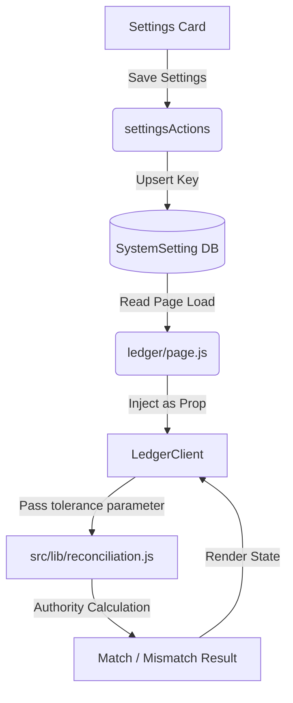

# Settlement & Ledger Settings Subsystem Documentation

The Settlement & Ledger Settings subsystem manages operational configuration flags for the reconciliation process and confirmation behaviors inside Business Mart.

---

## ⚠️ Core Rule: Configuration vs authority

Reconciliation & Ledger calculations are governed entirely by the authority calculation layer under `src/lib/reconciliation.js`.
The Settings Module behaves strictly as a **Behavioral Configuration Layer (Config Only)**.

**SETTINGS MUST NEVER:**
- Replicate, modify, or override comparison formulas or matching rules.
- Direct-calculate matches/mismatches inside UI client modules.
- Mutate ledger double-entry bookkeeping data structures.

---

## 🗄️ Storage Schema & Key

All settings are persisted inside the `SystemSetting` table under the unique key:

```text
settlement_ledger_settings
```

### JSON Schema

```json
{
  "reconciliationTolerance": 1.00,
  "autoMarkOutdatedInvoices": true,
  "requireConfirmationBeforeRegeneration": true
}
```

---

## ⚙️ Setting Keys & Behaviors

### 1. Reconciliation Tolerance (`reconciliationTolerance`)
- **Default**: `1.00`
- **Purpose**: Defines the maximum threshold (in Rs.) below which a buyer-supplier billing mismatch is dynamically considered "Matched" on the ledger dashboard.
- **Integration**: Passed dynamically as the `tolerance` argument into the central reconciliation engine (`calculateReconciliationSummary(invoices, sales, tolerance)`). The logic check itself remains inside `src/lib/reconciliation.js`.

### 2. Auto Mark Outdated Invoices (`autoMarkOutdatedInvoices`)
- **Default**: `true`
- **Purpose**: Triggers warnings and outdated badges in lists and pages if underlying quantities change. No database state mutation is automatically executed.

### 3. Require Confirmation Before Regeneration (`requireConfirmationBeforeRegeneration`)
- **Default**: `true`
- **Purpose**: Toggles modal safety dialog prompts when regenerating historic invoice periods to prevent unintended overrides.

---

## 🛡️ Global Adjustment Visibility Rule
- Adjustment visibility settings are managed centrally and globally under the `adjustments_visibility` settings tab.
- This tab is the single source of truth for visibility of adjustments in transaction creation forms, ledger preview pages, and printed receipt templates. Settlement & Ledger settings must not override or redefine this domain visibility.

---

## 🗺️ Integration Flow Diagram



