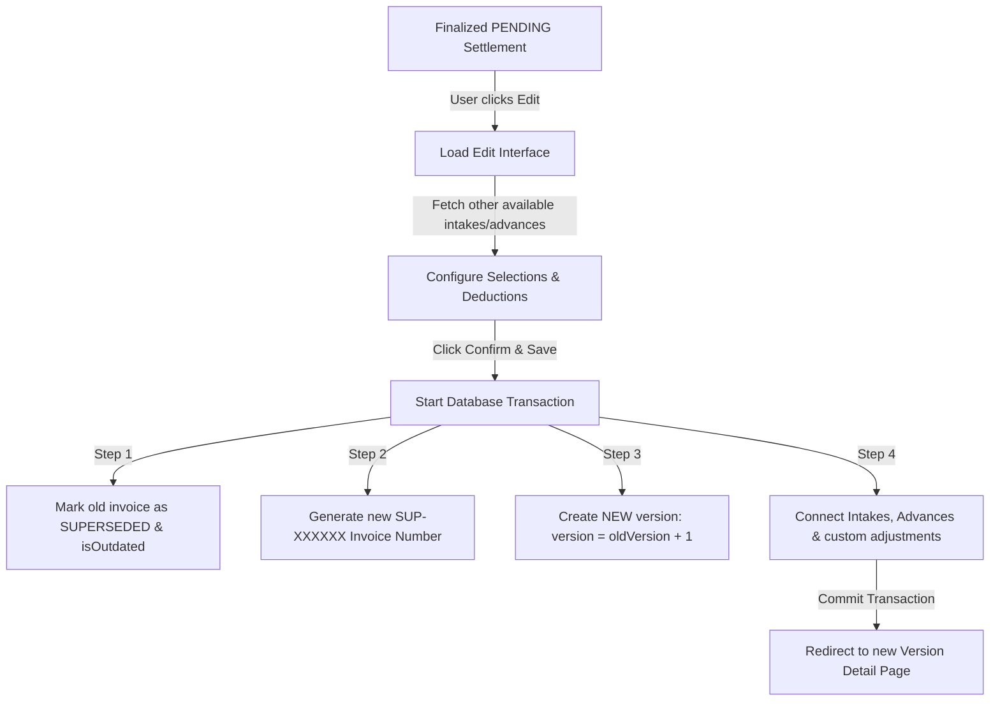

# Supplier Settlement (Invoice) Editing & Deletion Developer Guide

This document describes the design, architecture, and implementation of the **Supplier Settlement Edit & Delete lifecycle**, aligning it with the existing sales-side invoice management system.

---

## 🎯 Architectural Overview

Supplier Settlements (Supplier Invoices) are highly sensitive financial documents that consolidate grain intakes, cash advances, and multi-layered deductions. 

To maintain financial integrity and a clear audit trail while allowing adjustments, we implement a **"Regenerate & Version" workflow** (ledger history pattern) for edits, alongside a **secure hard deletion** workflow for pending items.



---

## ⚙️ Core Technical Rules & Guardrails

1. **Pending Constraint**: Editing or deletion is **strictly blocked** unless the invoice `status` is currently `PENDING`. If an invoice is `COMPLETED` or `SUPERSEDED`, the UI blocks access and displays specific resolution paths (reverting to PENDING first).
2. **Audit Ledger Versioning**: When an invoice is updated, the previous record is not updated in place. Instead, it is marked as `SUPERSEDED` and `isOutdated = true`, and a new sibling invoice is created with an incremented version number.
3. **Clean Deletion**: When an invoice is deleted, related item-level adjustments are automatically cascaded by the database. Relational references (like unlinked advances `IntakeAdvance`) are explicitly set to `null` before deletion, ensuring no orphaned state conflicts.

---

## 🛠️ Implementation Details

### 1. Service Layer (`SupplierInvoiceService.js`)

#### `editInvoice(oldInvoiceId, newIntakeIds, newAdvanceIds, newAdjustmentsByIntake)`
Executes atomically within a Prisma transaction:
- Validates the `PENDING` status of the old invoice.
- Marks the old invoice as `SUPERSEDED` and `isOutdated: true`.
- Fetches the active intakes and advances to build snapshot values.
- Recalculates all multi-layered deductions using `calculateSupplierDeductions`.
- Creates the next invoice with `version: oldInvoice.version + 1` and a brand new sequential invoice number (`SUP-XXXXXX`).

#### `deleteInvoice(invoiceId)`
Performs clean-up before removing the record:
- Disconnects all linked advances (`IntakeAdvance`) from the target invoice.
- Cascadely deletes the invoice, invoice items, and per-item adjustments.

```javascript
static async deleteInvoice(invoiceId) {
  const invoice = await SupplierInvoiceRepository.getById(invoiceId);
  if (!invoice) throw new Error("Invoice not found");
  if (invoice.status !== "PENDING") {
    throw new Error("Only PENDING invoices can be deleted");
  }

  return prisma.$transaction(async (tx) => {
    // Disconnect advances
    await tx.intakeAdvance.updateMany({
      where: { supplierInvoiceId: parseInt(invoiceId) },
      data: { supplierInvoiceId: null }
    });
    // Delete the invoice itself (Cascaded by database)
    await tx.supplierInvoice.delete({
      where: { id: parseInt(invoiceId) }
    });
    return { success: true };
  });
}
```

---

### 2. Server Controller Action Layer (`supplierInvoiceActions.js`)

Implements client-callable Next.js Server Actions:
- **`editSupplierInvoiceAction(formData)`**: Parses payload and invokes the edit transaction, forcing Next.js cache revalidation for path `/supplier-invoices` and `/supplier-invoices/[id]`.
- **`deleteSupplierInvoiceAction(invoiceId)`**: Executes safe deletion and triggers path revalidation.

---

### 3. Client UI Components & Routing

#### `InvoiceGenerator.js` (Multi-Step Wizard Component)
- **Props**: Accepts `initialInvoice` to activate Edit Mode.
- **Initializer Hook**: If `initialInvoice` is provided, it skips Step 1 (Supplier Selection) since a supplier cannot be changed on an active settlement, setting state straight to Step 2.
- **Unified Data Loading**: Combines the linked intakes and advances of `initialInvoice` with other uninvoiced/unlinked items fetched from `getUninvoicedDataAction`, allowing instant adds and removals.
- **Dynamic Action Button**: Customizes back-navigation to return directly to the detail page, and reroutes submission to `editSupplierInvoiceAction`.

#### Router: `/src/app/supplier-invoices/[id]/edit/page.js`
- Serves as the page component for `/supplier-invoices/[id]/edit`.
- Renders the custom blocking screen if the invoice is not `PENDING`.
- Queries list of active suppliers and feeds them into `InvoiceGenerator` alongside the parsed JSON model.

---

## 🎨 Consistent UI Alignment

To ensure a seamless design language across the application, the **Supplier Invoice Details** action buttons have been aligned to look identical in order, styling, and behavior to the **Sales Detail** pages:

```javascript
<div className="flex items-center gap-3">
  {invoice.status === "PENDING" && (
    <Link
      href={`/supplier-invoices/${invoice.id}/edit`}
      className="flex items-center gap-2 border px-4 py-2 rounded-lg text-sm font-medium hover:bg-accent transition-colors"
    >
      <Edit2 className="h-4 w-4" />
      Edit
    </Link>
  )}
  <PrintButtons
    type="settlement"
    data={{ invoice, intakeBreakdowns, summaryAdjustments }}
    filename={`Settlement-${invoice.invoiceNumber || invoice.id}`}
  />
  <DeleteButton 
    id={invoice.id} 
    deleteAction={deleteSupplierInvoiceAction} 
    redirectPath="/supplier-invoices" 
    label="Supplier Invoice" 
    buttonText="Delete"
  />
  {invoice.isOutdated && invoice.status !== "SUPERSEDED" && (
    <RegenerateButton invoiceId={invoice.id} />
  )}
</div>
```

- **Edit Button**: Custom-tailored to be a light border style with a hover transition (`hover:bg-accent`) and utilizes the `Edit2` icon.
- **Delete Button**: Imports and integrates `@/components/DeleteButton`, rendering a functional, warning-prompting Delete button that coordinates with `deleteSupplierInvoiceAction`.

---

## ✅ QA Verification Checklist

- [ ] **Pending Block check**: Verify that attempting to load `/supplier-invoices/[id]/edit` for a `COMPLETED` invoice shows the premium block screen and prevents editing.
- [ ] **History Logs Verification**: Edit a PENDING invoice. Confirm that:
  - The older invoice has its status set to `SUPERSEDED` and `isOutdated: true`.
  - A new version is generated with an incremented version (e.g. `V2`).
  - Adjusted per-intake calculations are applied accurately.
- [ ] **Deletion Check**: Click the **Delete** button on a PENDING invoice. Verify that:
  - A confirmation prompt is displayed.
  - Upon deletion, the database deletes the invoice and cascaded items.
  - Linked advances (`IntakeAdvance`) are not deleted but successfully returned to the "Unlinked" pool.
