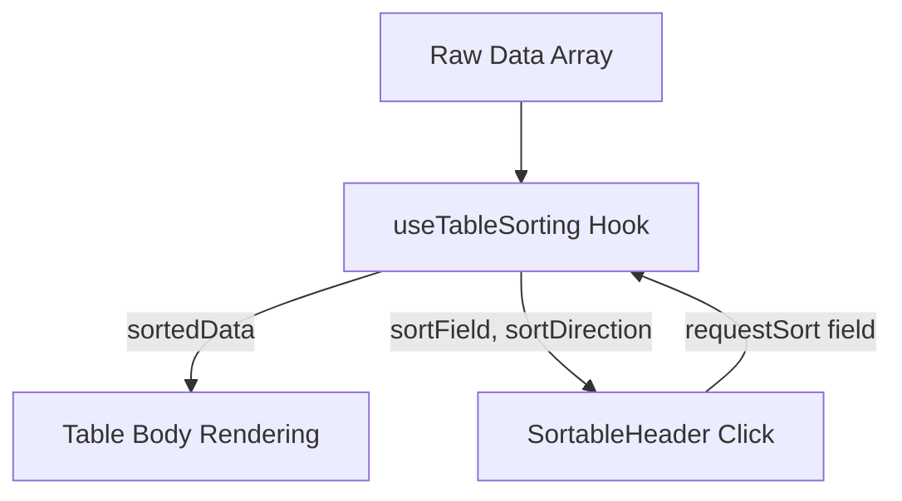

# Table Sorting Framework Developer Guide

This document describes the shared table sorting framework implemented in Business Mart, which allows sorting tabular list data dynamically based on string, number, or date data types.

---

## Architecture Overview

The framework consists of two core reusable parts:
1. **`useTableSorting` Custom Hook**: A generic, zero-dependency React hook that manages sorting state, resolves nested properties (via dot-notation), and sorts arrays dynamically.
2. **`SortableHeader` Component**: A presentation component that wraps table headers (`<th>`), renders up/down chevrons representing sort status, and aligns them cleanly.



---

## 1. Custom Hook: `useTableSorting`

Defined in: [`src/hooks/useTableSorting.js`](file:///d:/Projects/Next%20JS/src/hooks/useTableSorting.js)

### Hook API
```javascript
const { sortedData, sortField, sortDirection, requestSort } = useTableSorting(data, defaultSortField, defaultSortDirection);
```

### Parameters
- `data` (Array): The list of items to be sorted.
- `defaultSortField` (String | null): The path of the field to sort by default (e.g., `'entryDate'`).
- `defaultSortDirection` (String): Either `'asc'` (ascending) or `'desc'` (descending). Defaults to `'asc'`.

### Returned Values
- `sortedData` (Array): The sorted clone of the data array.
- `sortField` (String | null): Currently active sort field key.
- `sortDirection` (String): Currently active sort direction (`'asc'` or `'desc'`).
- `requestSort` (Function): Callback trigger to sort by a specific field key.

### Smart Type Comparisons
The hook automatically detects types:
- **Nested Objects**: Dot-notation paths like `party.name` or `intakeTransaction.intakeNumber` are resolved dynamically.
- **Dates**: Recognized if the value starts with `YYYY-MM-DD` or is a `Date` object. Compares using `Date.prototype.getTime()`.
- **Numbers**: Recognized if the value is a number or numeric string. Compares mathematically.
- **Strings**: Uses case-insensitive local comparison (`localeCompare`).
- **Nulls & Undefined**: Automatically placed at the end of the list.

---

## 2. Component: `SortableHeader`

Defined in: [`src/components/SortableHeader.js`](file:///d:/Projects/Next%20JS/src/components/SortableHeader.js)

The component acts as a drop-in replacement for standard table headers (`<th>`). It accepts:
- `field` (String): The sorting key/path.
- `currentSortField` (String): The active sorting key from the hook.
- `currentSortDirection` (String): The active direction (`'asc'`/`'desc'`).
- `onRequestSort` (Function): The hook's `requestSort` handler.
- `className` (String): Additional styles (including text alignment triggers like `text-right` or `text-center`).

### Dynamic Alignment Logic
To keep layout designs premium, `SortableHeader` parses the `className`:
- If `text-right` is present, it aligns the header text and sort icon to the right (`justify-end`).
- If `text-center` is present, it centers them (`justify-center`).
- Otherwise, it aligns left.

---

## How to Implement Sorting on a New Page

Follow these steps to add sorting to any new list table:

### Step 1: Pre-calculate computed fields (optional)
If your table renders custom client-side calculations (like `weight * rate`), calculate them beforehand in a `useMemo` block so they can be sorted on:
```javascript
const mappedData = useMemo(() => {
  return rawData.map(item => ({
    ...item,
    supplierName: item.party?.name || "",
    totalPayable: Number(item.amount) - Number(item.tax)
  }));
}, [rawData]);
```

### Step 2: Initialize the hook
```javascript
const { sortedData, sortField, sortDirection, requestSort } = useTableSorting(mappedData, "entryDate", "desc");
```

### Step 3: Replace Table Headers
Replace `<th>` cells with `<SortableHeader>`:
```javascript
<thead>
  <tr className="border-b bg-muted/50 text-[10px] uppercase font-bold text-muted-foreground tracking-widest">
    <SortableHeader
      field="supplierName"
      currentSortField={sortField}
      currentSortDirection={sortDirection}
      onRequestSort={requestSort}
    >
      Supplier
    </SortableHeader>
    <SortableHeader
      field="totalPayable"
      currentSortField={sortField}
      currentSortDirection={sortDirection}
      onRequestSort={requestSort}
      className="text-right"
    >
      Amount
    </SortableHeader>
    {/* Static non-sortable columns */}
    <th className="px-4 py-3 font-semibold select-none">Actions</th>
  </tr>
</thead>
```

### Step 4: Map Over `sortedData`
Update your table body map to iterate over `sortedData` instead of raw arrays:
```javascript
<tbody>
  {sortedData.map(item => (
    <tr key={item.id}>
      <td>{item.supplierName}</td>
      <td className="text-right">Rs. {item.totalPayable}</td>
    </tr>
  ))}
</tbody>
```
