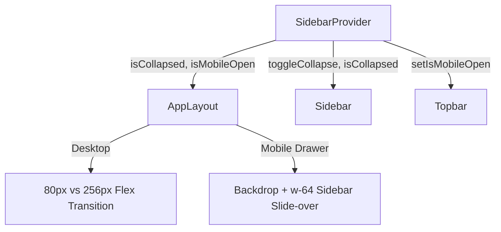

# Collapsible Responsive Navigation & Mobile Drawer Pattern

This developer guide details the premium design system pattern used for rendering a collapsible sidebar on desktop and a slide-over drawer menu on mobile devices. It outlines the state coordination, layout transitions, branding integrity, and simple hover tooltips.

---

## 🎯 The Core Goal: Dynamic Space Management

As the Business Mart system grows with more modules, optimizing screen real estate is critical:
1. **Desktop Screens**: The sidebar should collapse from `256px` to a compact `80px`, hiding text labels and showing only icons, to give the workspace maximum width.
2. **Mobile Screens**: The sidebar should never collapse. Instead, it must be hidden entirely and toggled via a hamburger button in the `Topbar`, sliding in as a full-width drawer with a dark backdrop and a dedicated close button.
3. **Synchronized Layout Resizing**: All width adjustments on desktop must transition smoothly across the layout (Sidebar and main content) without any sudden visual jumps or glitches.

---

## 🛠️ The Architecture: Orchestrated Layout State

We introduced a double-orchestrated model combining a Context Provider, a layout wrapper, and the navigation/header components.



### 1. State Coordination (`SidebarContext.js`)

A custom React Context handles coordination. It resolves Next.js SSR hydration mismatches by initializing the collapse preference from `localStorage` inside a `useEffect` hook:

```javascript
import React, { createContext, useContext, useState, useEffect } from "react";

const SidebarContext = createContext();

export function SidebarProvider({ children }) {
  const [isCollapsed, setIsCollapsed] = useState(false);
  const [isMobileOpen, setIsMobileOpen] = useState(false);

  useEffect(() => {
    try {
      const stored = localStorage.getItem("sidebar-collapsed");
      if (stored !== null) {
        setIsCollapsed(stored === "true");
      }
    } catch (e) {}
  }, []);

  const toggleCollapse = () => {
    setIsCollapsed((prev) => {
      const next = !prev;
      localStorage.setItem("sidebar-collapsed", String(next));
      return next;
    });
  };

  return (
    <SidebarContext.Provider value={{ isCollapsed, toggleCollapse, isMobileOpen, setIsMobileOpen }}>
      {children}
    </SidebarContext.Provider>
  );
}
```

### 2. Layout Wrapping & Flex Animation (`AppLayout.js`)

`AppLayout` is a Client Component wrapper inside `src/app/layout.js`. By keeping the desktop sidebar and the main content area in the same flex parent and animating the sidebar width with transition classes, the main content area resizes in perfect sync:

```javascript
export function AppLayout({ children }) {
  const { isCollapsed, isMobileOpen, setIsMobileOpen } = useSidebar();

  return (
    <div className="flex h-screen w-screen overflow-hidden bg-background">
      {/* Desktop Sidebar Container (smooth transition) */}
      <div 
        className="hidden md:block h-full transition-all duration-300 ease-in-out shrink-0 border-r"
        style={{ width: isCollapsed ? "80px" : "256px" }}
      >
        <Sidebar />
      </div>

      {/* Mobile Drawer (backdrop + slide-in content) */}
      {isMobileOpen && (
        <div className="fixed inset-0 z-50 flex md:hidden">
          <div className="fixed inset-0 bg-black/40 backdrop-blur-sm" onClick={() => setIsMobileOpen(false)} />
          <div className="relative z-10 flex h-full w-64 flex-col bg-card border-r shadow-2xl animate-in slide-in-from-left duration-300">
            <Sidebar forceExpanded onClose={() => setIsMobileOpen(false)} />
          </div>
        </div>
      )}

      {/* Workspace Area */}
      <div className="flex flex-1 flex-col overflow-hidden min-w-0 transition-all duration-300 ease-in-out">
        <Topbar />
        <main className="flex-1 overflow-y-auto p-6">
          {children}
        </main>
      </div>
    </div>
  );
}
```

### 3. Responsive Branding & Simple CSS Tooltips (`Sidebar.js`)

Branding remains highly recognizable. The custom gradient **"BM" logo badge** is always visible. In expanded state, the full title "Business Mart" fades in.

To prevent CSS bugs and accessibility traps, collapsed navigation items display their titles on hover using a rock-solid, purely CSS-driven absolute tooltip (`hidden group-hover:block`):

```javascript
{menuItems.map((item) => {
  const Icon = item.icon;
  const isActive = pathname === item.href;
  
  return (
    <Link
      key={item.name}
      href={item.href}
      className={cn(
        "flex items-center rounded-lg py-2.5 transition-all duration-200 relative group",
        isCollapsed ? "justify-center px-0 mx-1" : "gap-3 px-3 mx-0",
        isActive ? "bg-primary text-primary-foreground shadow-sm" : "hover:bg-accent hover:text-accent-foreground"
      )}
    >
      <Icon className="h-5 w-5 shrink-0 transition-transform duration-200 group-hover:scale-105" />
      
      {!isCollapsed && (
        <span className="text-sm font-medium whitespace-nowrap overflow-hidden text-ellipsis animate-in fade-in duration-200">
          {item.name}
        </span>
      )}

      {/* Simple, CSS-triggered tooltip in collapsed state */}
      {isCollapsed && (
        <div className="absolute left-full ml-3 z-50 hidden group-hover:block rounded-md bg-popover text-popover-foreground px-2.5 py-1.5 text-xs font-semibold shadow-lg border border-border whitespace-nowrap">
          {item.name}
        </div>
      )}
    </Link>
  );
})}
```

---

## 📌 Standard Design Rules
When adding new pages or expanding layout items:
1. **Never override layout width constraints**: The width of the sidebar must solely be controlled by the `isCollapsed` state inside `AppLayout.js` via the `style={{ width }}` property.
2. **Keep Tooltips Simple**: Avoid JS-heavy tooltip libraries. The CSS-driven `group-hover:block` pattern provides perfect performance and zero DOM-lifecycle bugs.
3. **Mobile Drawer Behavior**: Mobile layouts should always render the sidebar inside a slide-over container. Always pass `forceExpanded` and `onClose` props to `<Sidebar />` inside mobile views.
