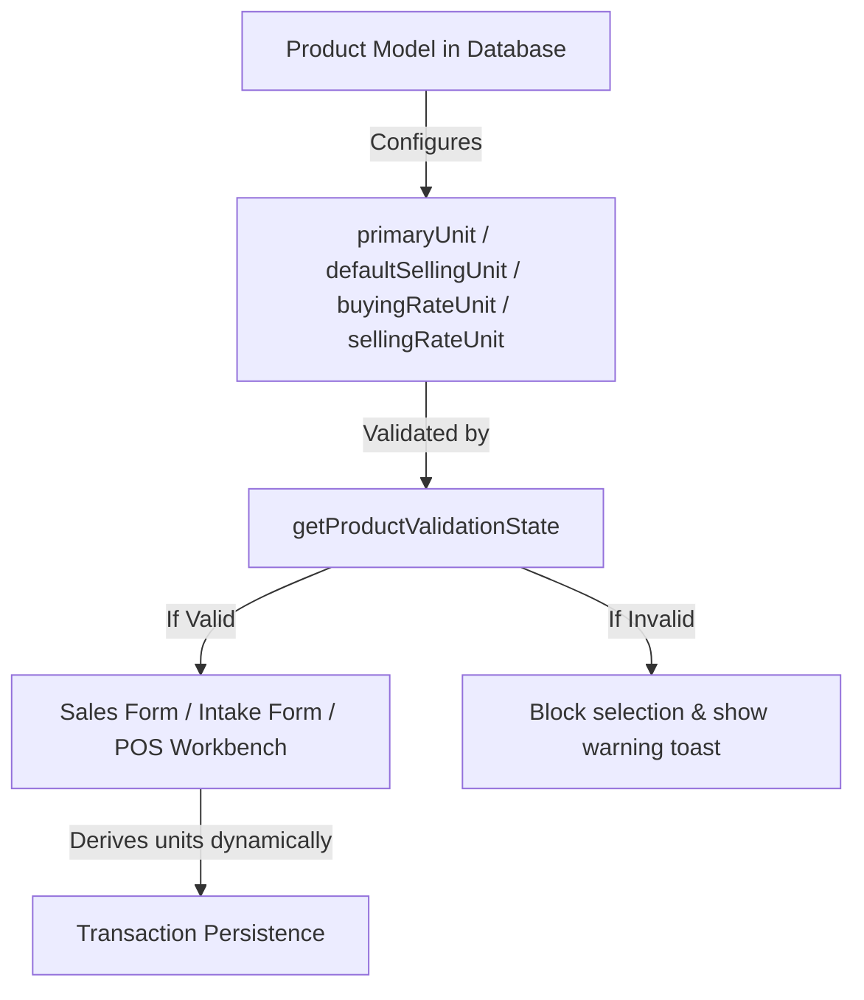

# Product-Centric Unit Management Architecture

This document describes the design and operational rules of the Product-Centric Unit Management architecture in Business Mart. 

---

## 1. Architectural Overview

To prevent data drift and eliminate silent fallback assumptions, Business Mart has migrated from a global/user-level display preference model (`localStorage`-driven) to a strict **Product-Centric Unit Configuration** model.

Under this model, the **Product Definition** is the single source of truth for all transactional unit behavior.



---

## 2. Product Configuration Requirements

Every active product must be fully configured with a valid unit profile before it can be used in any transaction.

### Required Fields
1. **`primaryUnit`**: The base storage/measurement unit of the product (e.g. `KG`, `LITER`, custom bags).
2. **`defaultSellingUnit`**: The default unit selected when adding this product to sales.
3. **`buyingRateUnit`**: The standard rate unit for calculating supply costs during intakes.
4. **`sellingRateUnit`**: The standard rate unit for calculating revenue during sales.

### Canonical Validation Utility
The system centralizes validation logic in `@/modules/products/utils/productValidation.js`. 
Developers must use `getProductValidationState(product)` to assess if a product is operational.

```javascript
import { getProductValidationState } from "@/modules/products/utils/productValidation";

const validation = getProductValidationState(product);
if (!validation.isValid) {
  // validation.errors contains details about missing fields
  console.error("Product configuration invalid:", validation.errors);
}
```

---

## 3. Form Lifecycle & Transaction Rules

### Zero Default Fallback Rule
Forms must never fallback to hardcoded unit strings (e.g., `"KG"`) if no product is selected. Instead:
- Unit states inside forms initialize to `null` or `""`.
- Select dropdowns display a placeholder (`--`) when empty.

### Manual Selection Constraints
When a user attempts to select a product in `SaleForm`, `IntakeForm`, or `EditIntakeForm`:
1. The selection handler invokes `getProductValidationState(product)`.
2. If the product is **invalid**:
   - The selection is blocked.
   - An error toast is displayed listing the missing configuration fields.
   - The form row resets its units to `null`.
3. If the product is **valid**:
   - The selection is accepted.
   - Form fields (such as `unit` and `rateUnit`) are populated directly from the product's attributes.

---

## 4. Preservation & historical Integrity

- **Transaction Unit Snapshots**: The measurement unit and rate unit are persisted on the transaction items at the moment of creation. 
- **Configuration Updates**: Changing a product's unit configuration tomorrow will **never** alter historical invoices or intake receipts. All past records remain completely decoupled from subsequent product changes.
