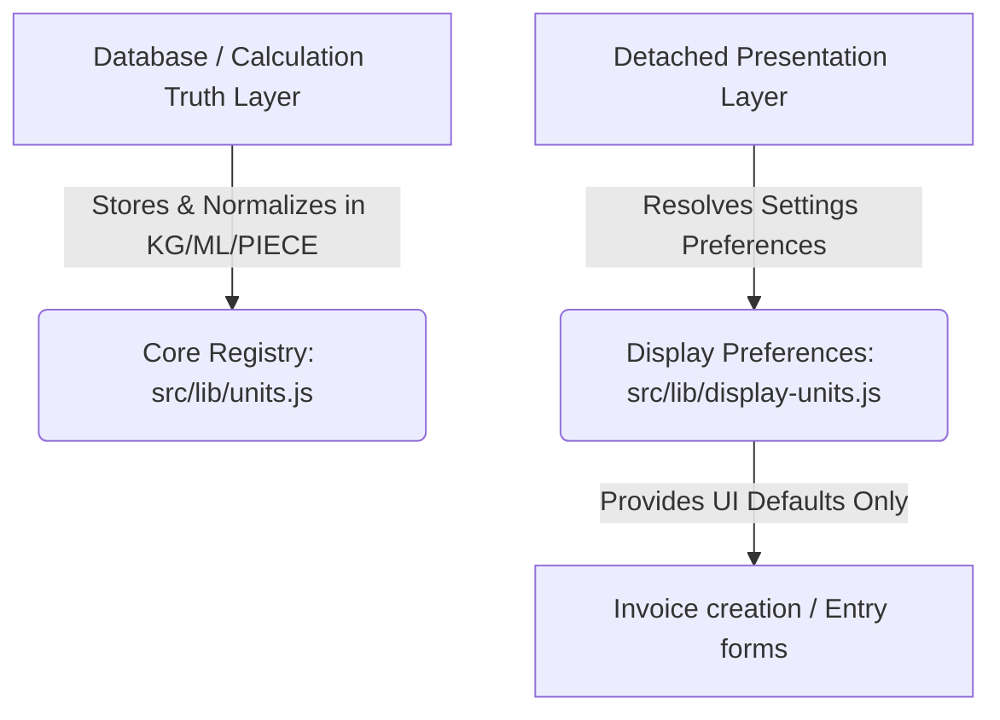

# UI Display Preference Layer

This document describes the architectural separation between the internal normalized storage truth layer and the detached, presentation-only UI Display Preference Layer.

---

## 1. Core Architecture

The Business Mart unit system is strictly divided into two independent layers:

### The Truth Layer (Immutable Storage)
- **Baseline Standard**: All weight and quantity values in the database, ledger, inventory, reconciliation, and transaction tables are stored and computed in standardized base units (`KG` for weight).
- **Core Operations**: Calculation engines (`normalizeQuantity`, `normalizeRate`, `convertRate`) reside purely in `src/lib/units.js` and operate on mathematically strict factors relative to `factor: 1`.

### The Presentation Layer (Interactive Display Preferences)
- **Scoped UI Settings**: Allows operators to set preferred default units (such as `MAUND` vs `KG`) for invoice entry screens via a Client Component setting panel.
- **LocalStorage Abstraction**: Stored locally in the user's browser via `localStorage` completely encapsulated in `src/lib/display-units.js`.
- **Purely Default Selections**: Form dropdowns default to the preferred units if they are compatible with the chosen product's category. Operators retain full ability to manually override dropdown values at entry time.
- **No Transformation on manual change**: Selecting different unit values in dropdowns does not silently scale or transform already entered numeric values to avoid user confusion.

---

## 2. Developer Guidelines & Abstractions

### Presentation Preference Methods (`src/lib/display-units.js`)

1. **`getPreferredWeightUnit()`**
   - Safely retrieves the preferred weight display unit (`KG` or `MAUND`). Fallback to `"KG"`. Includes client-safety checks.
   
2. **`getPreferredRateUnit()`**
   - Safely retrieves the preferred rate display unit (`KG` or `MAUND`). Fallback to `"KG"`.
   
3. **`formatWeightForInputUI(value, product)`**
   - Detached presentation utility converting kilograms to the preferred input unit for default presets.
   
4. **`formatRateForInputUI(rate, product)`**
   - Detached presentation utility converting normalized rate to the preferred rate unit.

---

## 3. Preservation Rules

To avoid data loss or calculation corruption, developers **must strictly adhere to the following rules**:

> [!CAUTION]
> **No Database Changes**: Never add preference indicators (`prefWeightUnitUsed`, `uiRateDisplay`) into Prisma schemas or database rows. Transactions must always save the actual physical values alongside their respective database-valid unit code.

> [!IMPORTANT]
> **No Auto-transform of Inputs**: Swapping a unit select option inside a creation form should **never** scale the already typed weight or rate values. Let the operator retain full manual control of inputs.

> [!NOTE]
> **Dynamic Mount Initialization**: Since Next.js uses server-side pre-rendering, always initialize client-side settings dynamically (e.g. inside `useEffect` or client event actions) to completely eliminate any React hydration mismatches.
